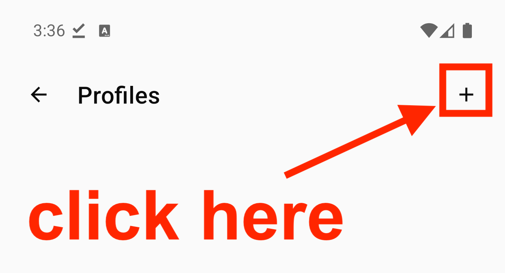
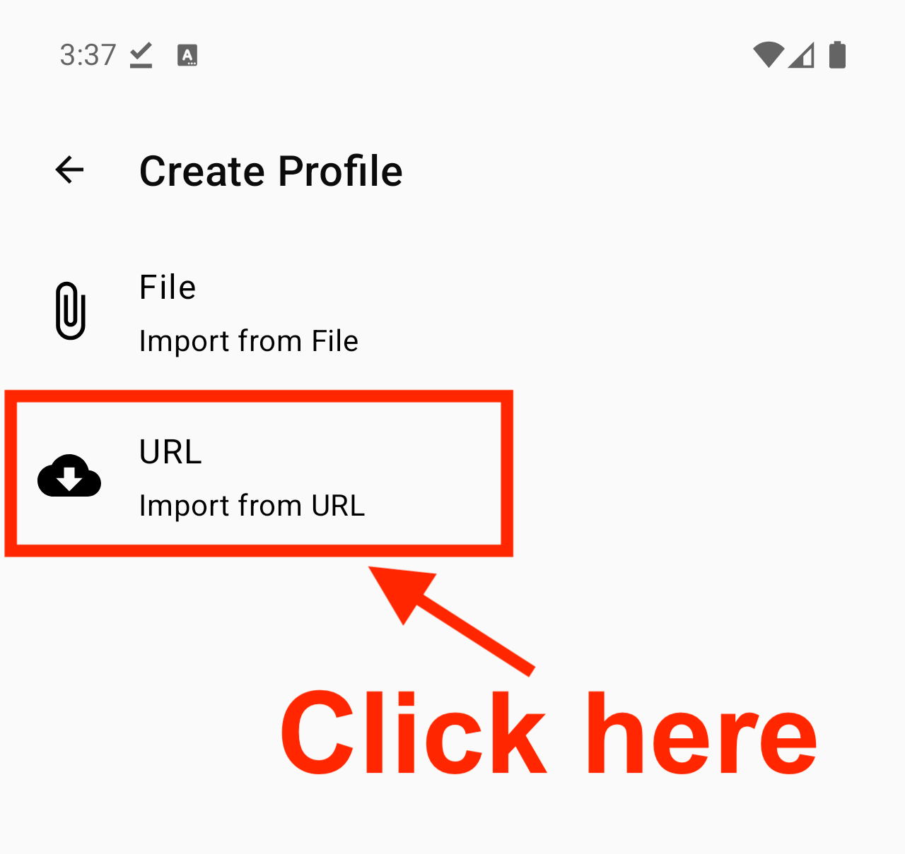
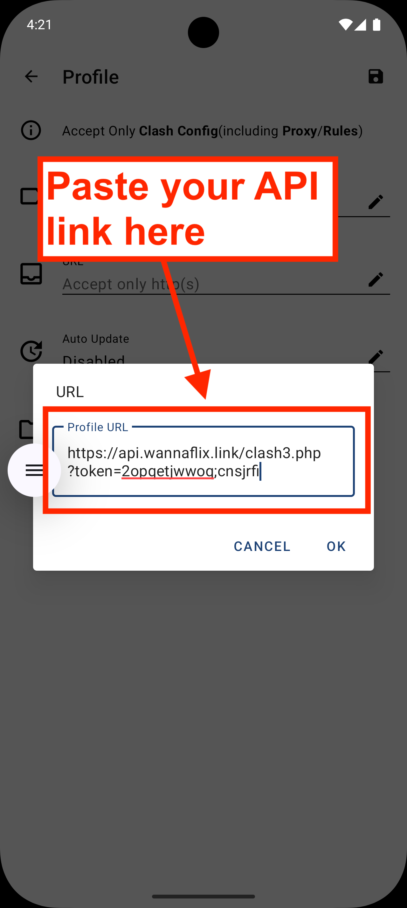
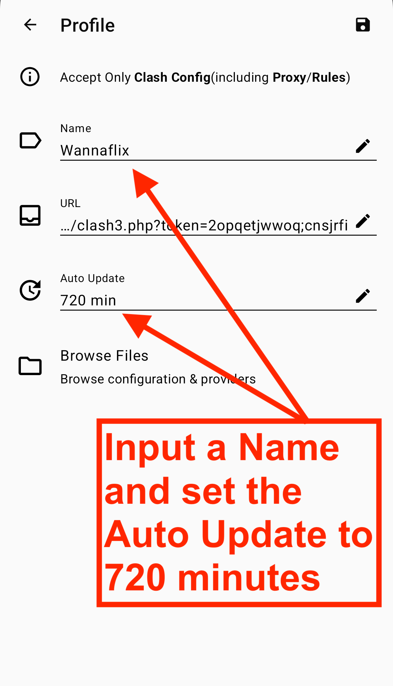
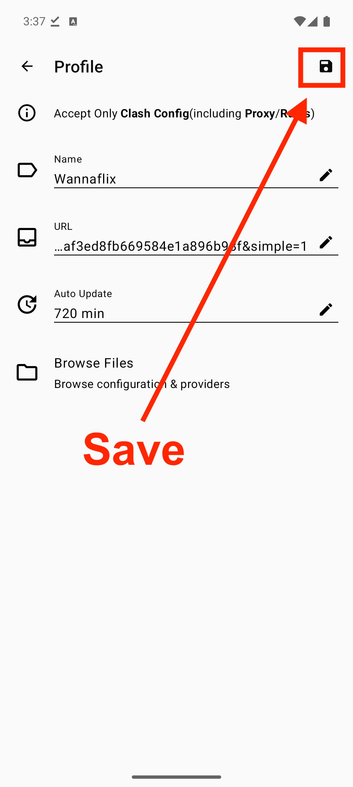
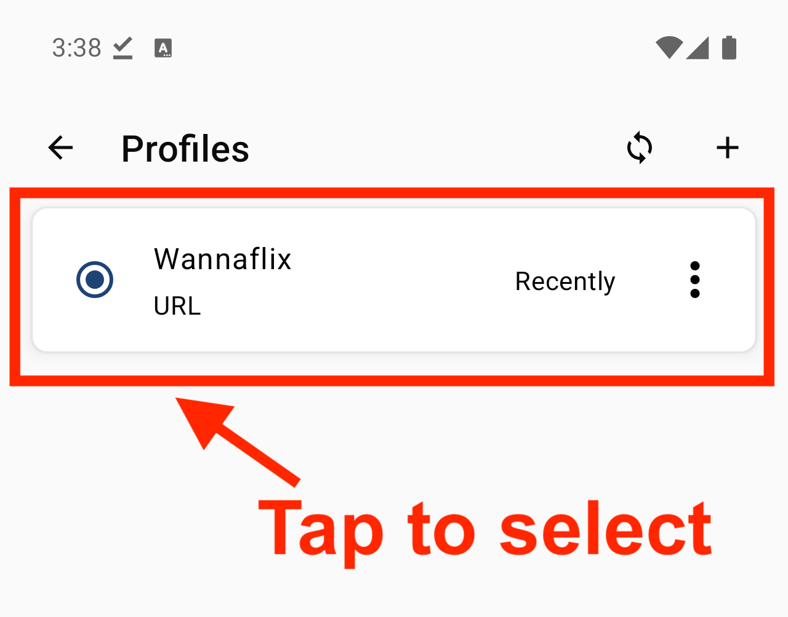
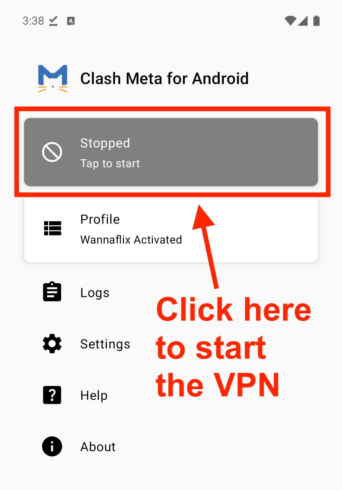
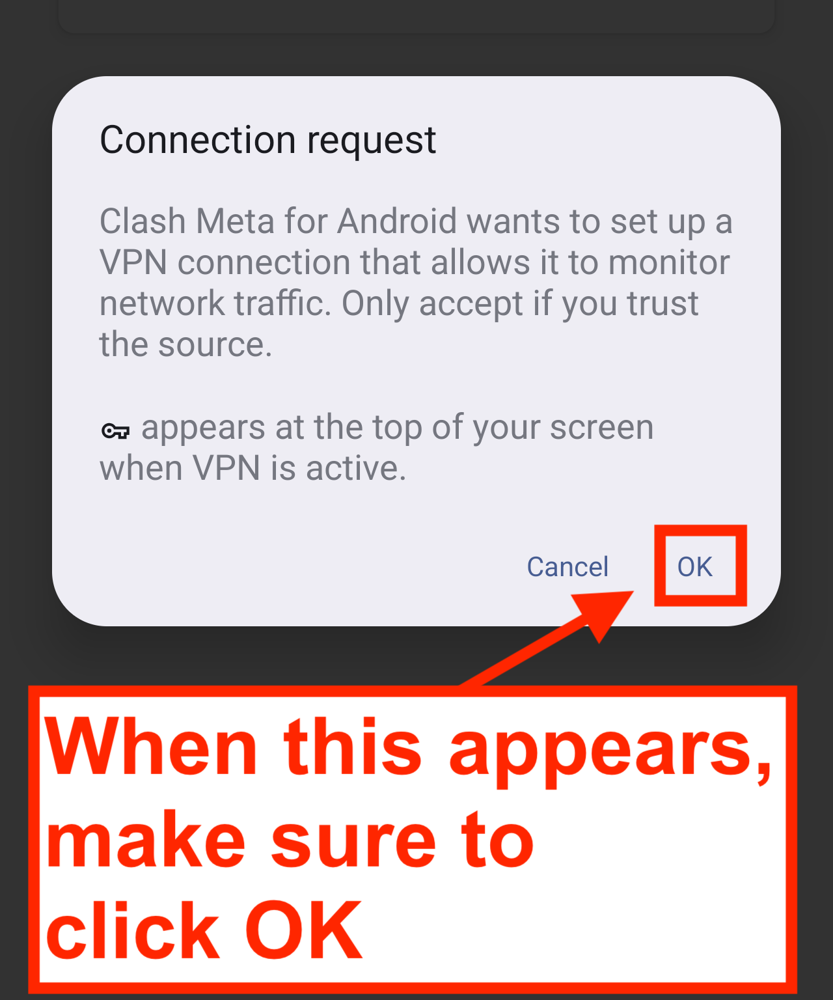
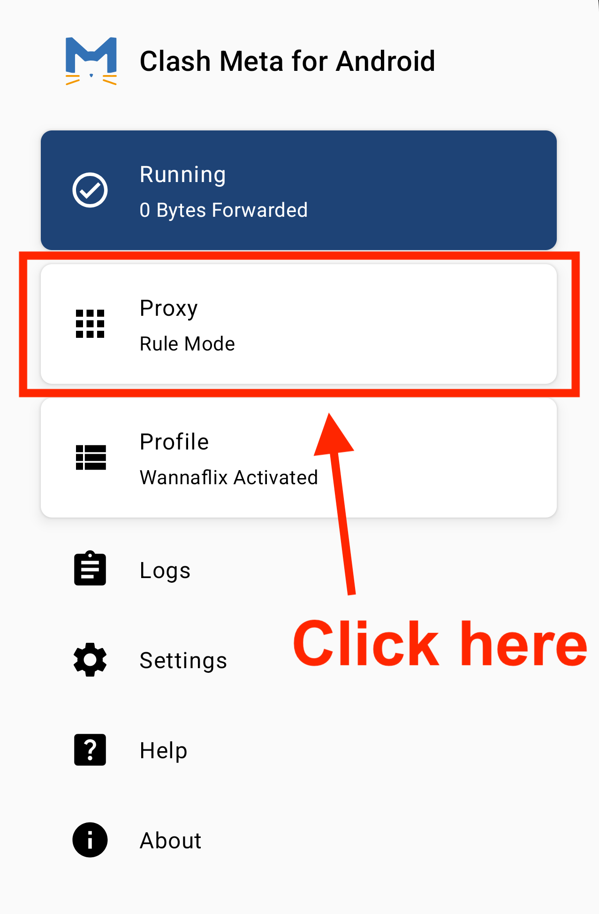
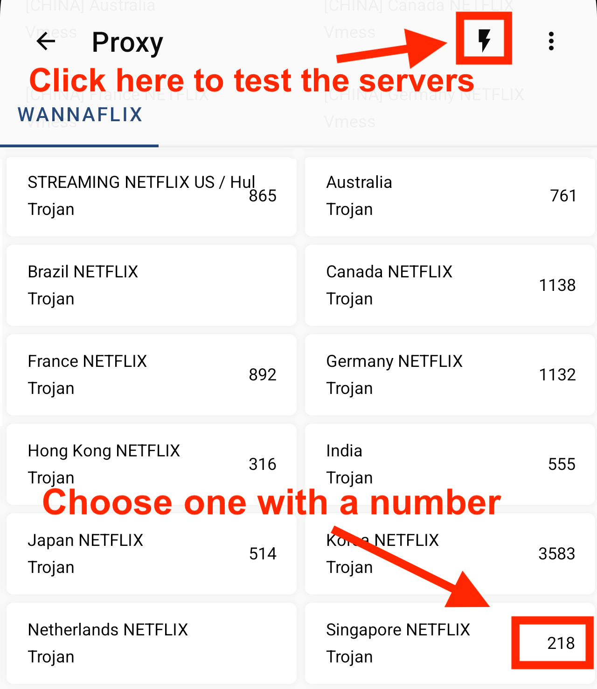

# 👍 Clash for Android

Updated: May 3, 2025


### Clash for Android version 2.11.9 and up (April 2025 release).&#x20;

Clash Meta for Android **version 2.11.9  and up** supports all major protocols, and works with all our servers.&#x20;


## STEP 1: Download and install Clash for Android


### Version: v2.11.9

[**Click here**](https://wannaflix-sz-edge.b-cdn.net/clash/android/cmfa-2.11.9-meta-universal-release.apk) **to download the app.**&#x20;

Alternative mirrors:

* Download on [Github](https://github.com/MetaCubeX/ClashMetaForAndroid/releases)&#x20;


### Install the Application

* Click the downloaded file, and it will install

### **Launch Clash for Android**

* Find `Clash for Android` in your applications and click on it&#x20;

## STEP 2: Import your config

### Copy the API

1. Login to your [client area](https://wannaflix.com/clientarea.php) dashboard
2. Select `Clash for Android` in the dropdown for Android
3. Click `Copy Simple Api`


### Different API types:

* **Simple API**: One proxy group, easy to set up, suitable for basic use. _**Recommended for new users.**_
* **Split-tunneling API**: Supports multiple proxy groups and service-based routing for advanced control.
* **Subconverter API**: A technical tool for advanced users to convert and customize subscription configs across different formats (Clash, Surge, etc.). \[Only if you know what it is]


### Paste the API&#x20;

1. Open `Clash for Android`
2. Tap `Profile` tab
3. Tap `+` → choose **Subscribe**.
4. Input:
   * **Name**: Wannaflix
   * **URL**: Paste your Clash API link&#x20;
   * **Auto Update:** 720
   * Tap `Save`

<figure><figcaption></figcaption></figure>

<figure><figcaption></figcaption></figure>

<figure><figcaption></figcaption></figure>

<figure><figcaption></figcaption></figure>

<figure><figcaption></figcaption></figure>

<figure><figcaption></figcaption></figure>

<figure><figcaption></figcaption></figure>

## STEP 3: Select a server and connect

### OPTION 1: Simple API


### Recommended setup for new users

If you see a different setup that the screenshots, check that you got the correct config API from our website


1. Select `Wannaflix`  as profile (**Profile** → Wannaflix)
2. Tap the profile once → it becomes active.
3. Go to the **Home** tab → tap the big **power button** to connect.
4. Tap **Proxy** to open the server list, run a test by tapping the **lightning bolt icong** (:zap:) in the top right corner
5. Select a server that has a number next to it (the lower the better)

<figure><figcaption></figcaption></figure>

<figure><figcaption></figcaption></figure>

<figure><figcaption></figcaption></figure>

<figure><figcaption></figcaption></figure>

<figure><figcaption></figcaption></figure>

<figure><figcaption></figcaption></figure>

### OPTION 2: Split-tunneling API - decide which server each site will go through


### Setup for advanced users

If you don't need split-tunneling, we recommend sticking to the Simple API setup above


1. Go to **Profile**
2. Tap the profile once → it becomes active.
3. Go to the **Home** tab → tap the big **power button** to connect.
4. Tap **Proxy** to open the server list, run a test by tapping the **lightning bolt icong** (:zap:) in the top right corner
5. Select a server that has a number next to it (the lower the better)


### Configure split tunneling (Optional)

1. In the **Proxy** tab you'll see a list of different groups (like `Wannaflix`,  `🍎 Apple`, or `📺 Netflix`)
2. Click on the **group** name (e.g., `📺 Netflix`)
3. Select the desired server from the list (e.g., 🇯🇵 Japan, 🇸🇬 Singapore, etc.)
4. &#x20;That service will now go through your selected server.&#x20;


### You are now connected.

* Try to go to [https://google.com](https://google.com) to check if the connection is working


### How to disconnect

Go to the **Home** tab → tap the big **power button** to disconnect.

