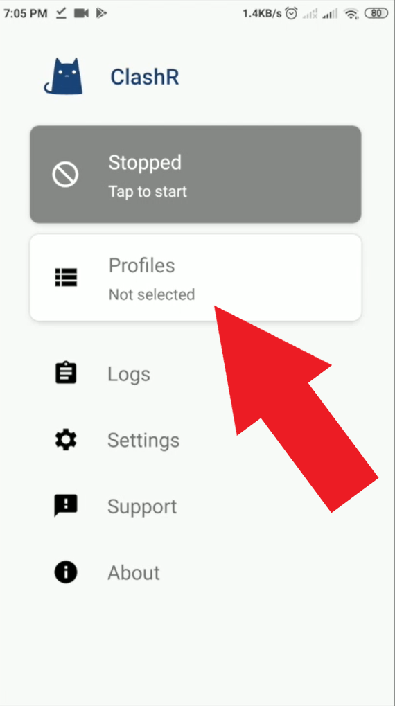
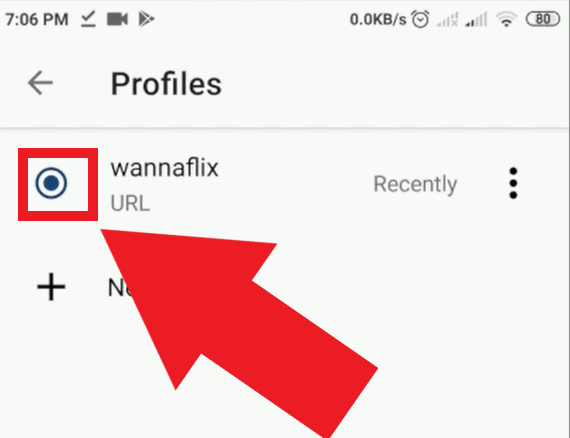
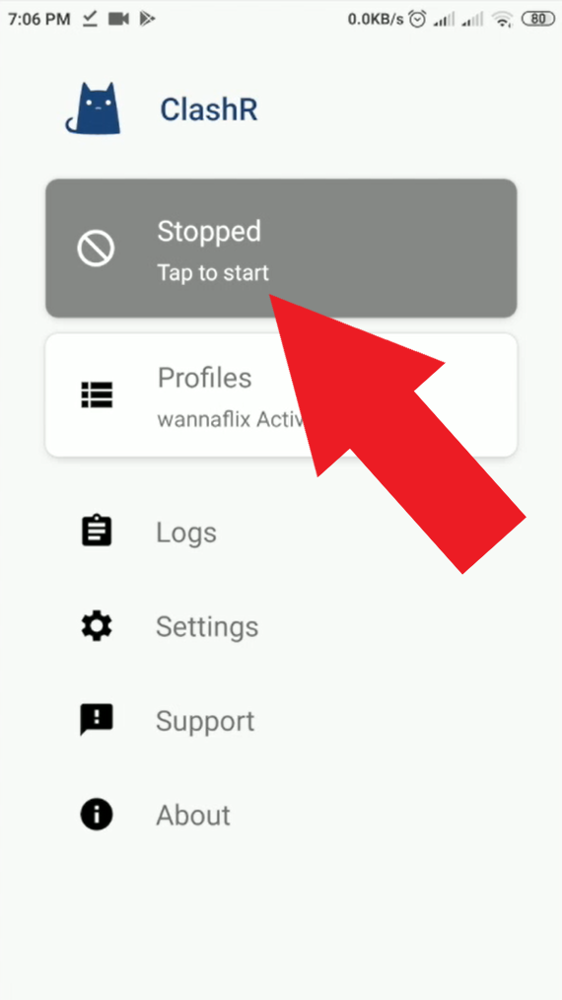
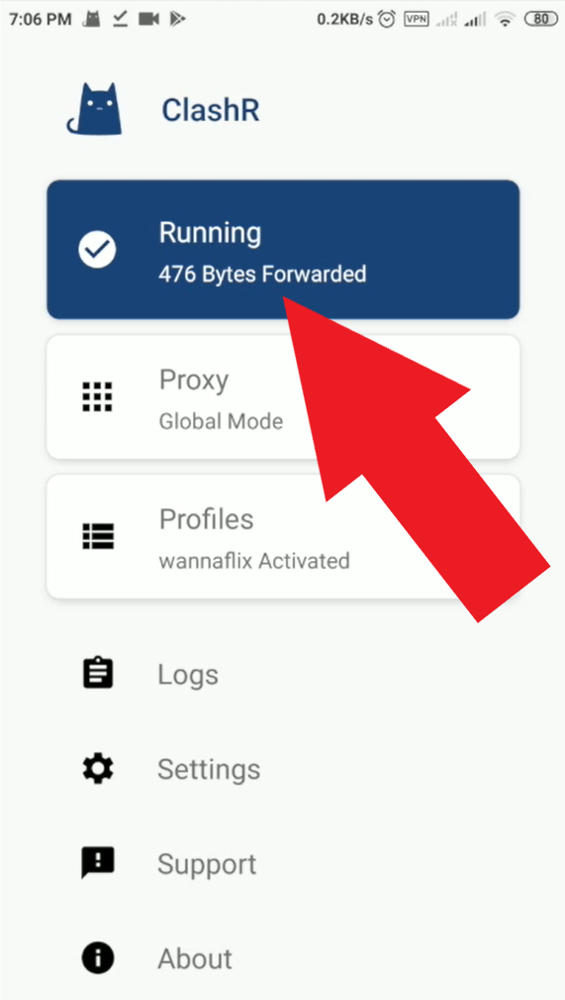

# ClashR for Android \(Recommended\)

Updated: October 11, 2020

ClashR for Android supports both v2ray and SSR. It has a clean and easy to use UI and is stable and fast. We recommend chosing this app.

## Watch Tutorial Video:

We highly recommend watching the video tutorial. You can stream it in China too.

[Video](https://watch.cloudflarestream.com/f8c5ab1c85bc573fe3c1faab226a5dc9)

## Download and Install ClashR for Android

[Click here](https://wannaflix.net/admin/supportdownloads.php?action=edit&id=28) to download the app.


Alternative mirrors:

Download on [Github](https://github.com/naicfeng/ClashRForAndroid/releases) \(get the 'universal' release. it'll work on all phones\)


1. Find the apk \(likely in your downloads\) and click on it to launch the installation. Make sure to click allow on any popup that may appear.
2. Once the app has installed, click "open"


You may need to allow apps from "Unknown Sources" on your phone for the installation to complete. 

A generic guide on how to do it:

1. Navigate to Setting &gt; Security.
2. Check the option “Unknown sources“.
3. Tap OK on the prompt message.
4. Select “Trust“.


## Add your servers via the API

### Get your API

1. Go to your [client area](https://wannaflix.com/clientarea.php) 
2. Click on the "Android ClashR" button in the API box to copy the API

### Paste your API

1. Open the ClashR app \(blue cat icon\)
2. Click on "Profiles" &gt; New Profile

    3. Select URL as the type

    4. Type "WannaFlix" in the Name box.

    5. Paste the API in the URL box. 

    6. Type "360" in the Auto Update box \(this will update the server list every 6 hours. Type "1440" instead if you want to update every 24 hours.\)

    7. Click the save button on the top right corner, and wait for it to download the server list.

    8. Select the newly added API from the list of profiles \(if you went back to the main page, click profiles again\)

Now, go back to the app main page.

## Connect

1. Click "Stopped" 

    2. Then click "Proxy" to select a server

    3. Select a server from the list


If there is a popup, click YES/OK


_YOU ARE NOW CONNECTED._

### To disconnect: 

Click the blue "Running" button.

### To reconnect:

Click the grey "Stopped" button.

## Troubleshooting

So far no common issues have been reported. We'll edit this section should the need arise.

