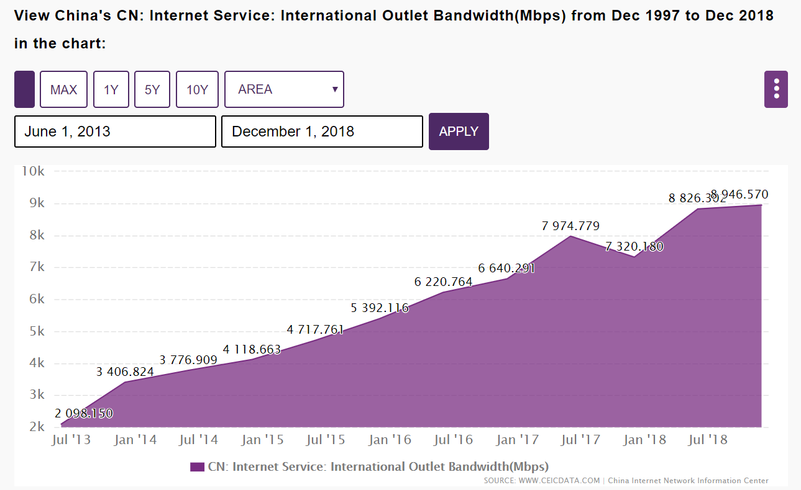

# What affects VPN speeds in China? \(26 March 2020\)

You may have noticed that your VPN speed has been going down recently. You may be wondering what exactly is going on and what changed.

Well today, we're going to have a look at what affects internet and VPN speeds in China, and what we at WannaFlix are doing to improve your internet.

Let's dive in!

### How the internet in China works

To understand what affect internet speeds, we first need to understand how the Chinese internet works. 

Unlike most other countries, ISPs \(internet service providers like China Telecom\) in China are regulated by the government. This means they have to submit to certain restrictions, including having to filter sites and content not approved for their Chinese audience.

How do they do that?

By setting up choke points where all bandwidth exiting and entering China is screened. This results in high packet loss, increased ping, and QoS \(quality of service, aka throttling of some connections\). 

That is the first reason why speeds are slow. 

The second reason why speeds are slow is because Chinese ISPs do not peer for free. Any other ISP who wants to connect to China Telecom, Unicom, or Mobile have to pay them for bandwidth, and they have to pay a lot.

For example, peering with China Telecom in Hong Kong can still cost upwards of $100 per Mbps for their quality connections. That means most ISPs will only purchase a small amount of bandwitdth to China, slowing down internet speeds to those countries even further.

This is why China Telecom connections to most of Asia \(other than Taiwan and Hong Kong\) tend to be so slow. 

A third reason why international connections in China are so slow, is simply because international bandwith is limited by the infrastructure itself. 

The Chinese online population has exceeded 840 million users in 2019. But the total international bandwidth available at the beginning of 2019 was just 10 Tbps! \([https://www.ceicdata.com/en/china/internet-international-outlet-bandwidth](https://www.ceicdata.com/en/china/internet-international-outlet-bandwidth)\)

That is just 10 million Mbps for the whole country. This means 84 people are sharing just 1 Mbps. 

Even if your home internet increases from 10Mbps to 100Mbps or even 200Mbps, it doesn't change the fact that you are sharing just 1Mbps with 84 other persons. 

In other words, the internation connections just haven't caught up.

### How WannaFlix works to improve your internet

So how do we guarantee fast speeds for you and all our users?

We do this in several ways:

One, by purchasing bandwidth from ISPs that peer directly with China. These servers usually cost between 3 to 7 times what other servers without direct connections cost, but we believe are well worth it.

Two, by purchasing servers within China that have a higher priority than residential connections. Remember how ISPs throttle some connections at the choke points? The key word here is "some". Chinese ISPs offer better speed packages to those who are willing to pay for it, including within China. So we shoulder the cost for our users and pay the ISPs to give us better speeds. 

This does not compromise your data in any way, as nothing is decrypted until it reaches our servers abroad. You'll need to send the encrypted data over the chinese internet either way, so might as well get a faster speed.

There are other ways we use of course, but we'll keep it as trade secrets for now. ;\)

### A word about the recent speed issues

Now that you understand how everything works, let's talk briefly about why things have been getting slower during the past month.

We originally had a deal with a datacenter within China that has special peering with China Telecom. We used this server to speed up connections to Eclipse and to our v2ray CHINA USERS servers, which is why they were so fast.

Unfortunately, the datacenter has had various issues within the last month, and since we didn't have this special server to speed things up, everything got really slow. 

Originally, the datacenter told us it was just a temporary problem that would be fixed within a few days. However, after almost 4 weeks, our servers there are still offline. 

During this time, we have tried to find other servers with such good bandwidth. Our first backup datacenter was DDOSed, and a second we tried was shutdown due to a neighboring server's owner using his server illegally \(the police shutdown the entire server rack and the datacenter is no longer accepting new clients\).

Finally we were able to find one that is relatively stable, which we now use for the Eclipse and CHINA USER servers. Speed on Eclipse is still slow, but the V2ray servers seem to be performing quite well. 

We also started testing a new way of speeding up the connection on the v2ray Australia server. 

If it turns out to be fast and stable, we'll be deploying it gradually to our other servers, so join us on our telegram channel to share your feedback with us! [https://t.me/wannaflixvpn](https://t.me/wannaflixvpn)

We're also testing  a UDP version of Eclipse that may give better speeds, so stay tunned for that as well.

We're always trying to find better ways to improve your speed and stability, so you can be sure that with WannaFlix, you'll always be at the bleeding edge of what is possible within China. 

