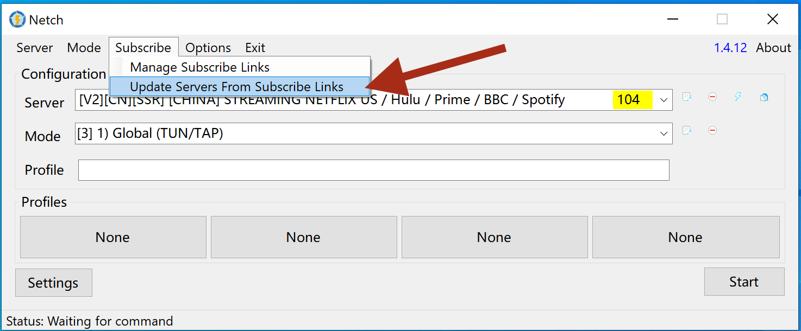
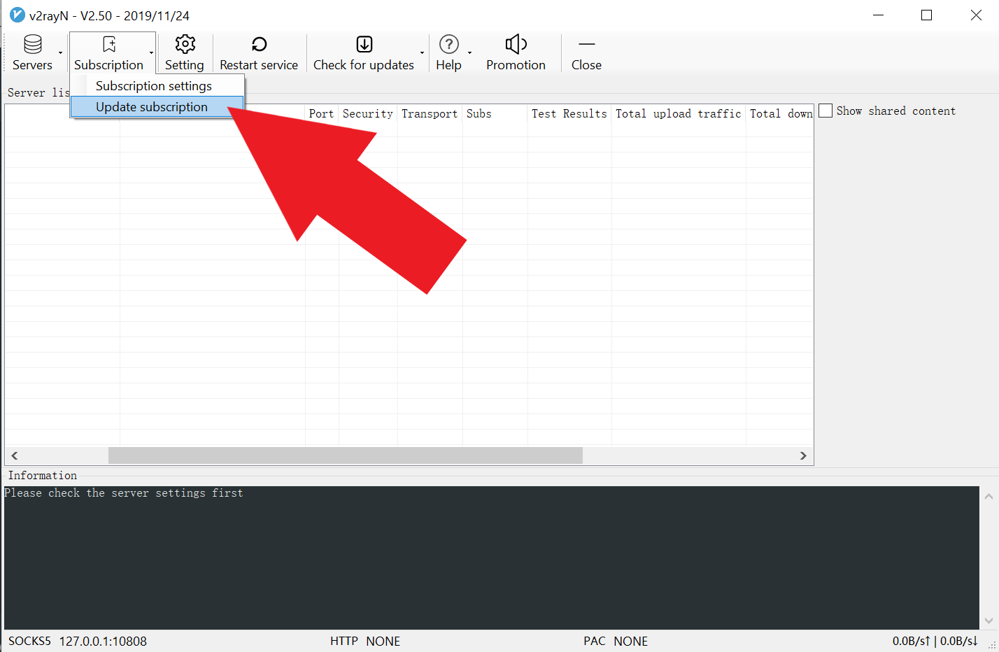
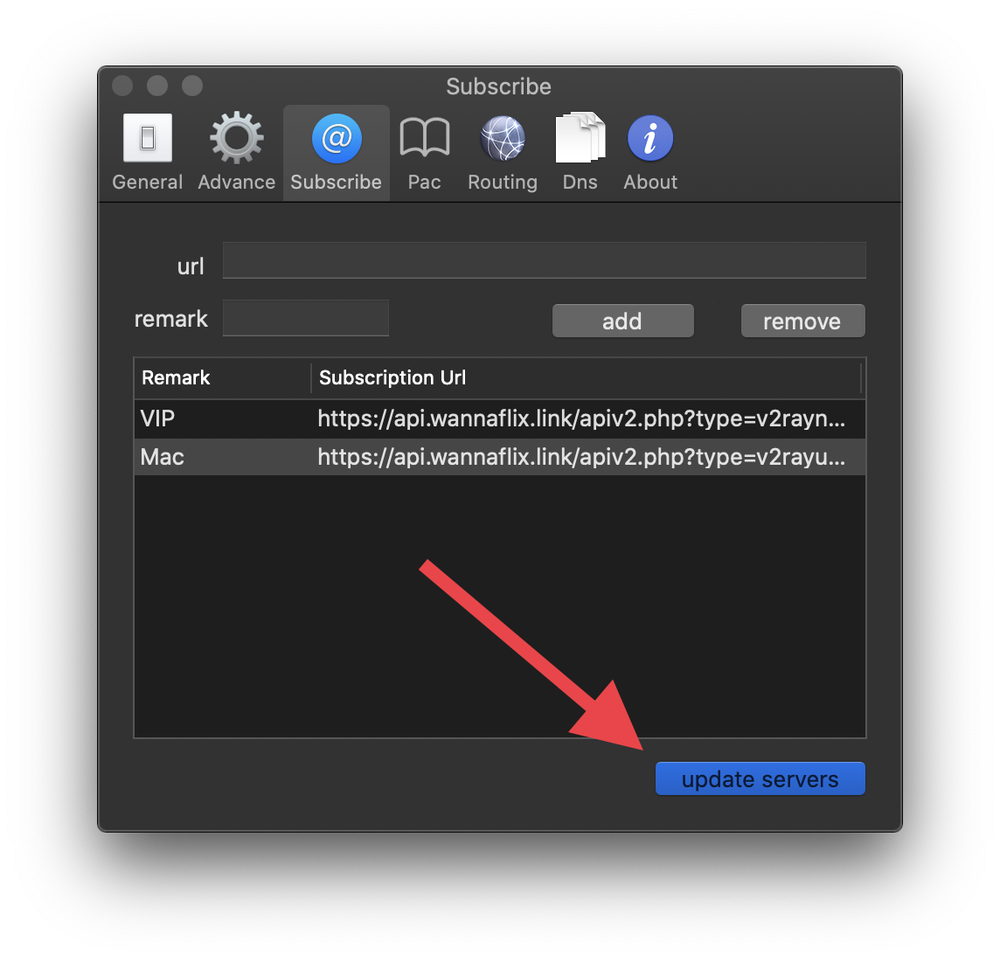
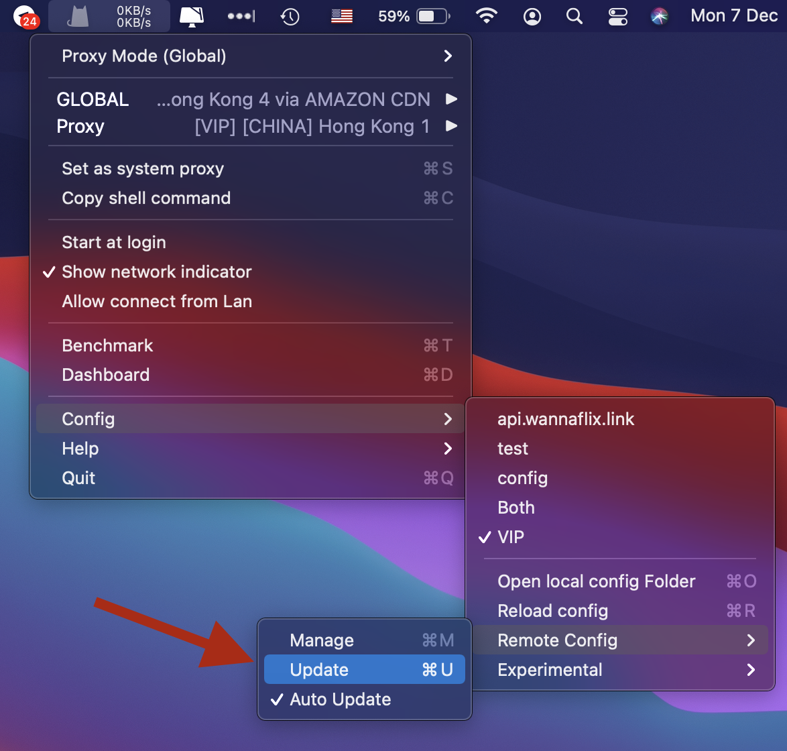
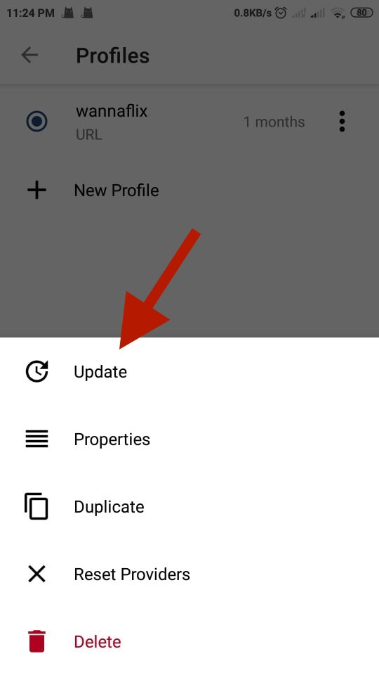
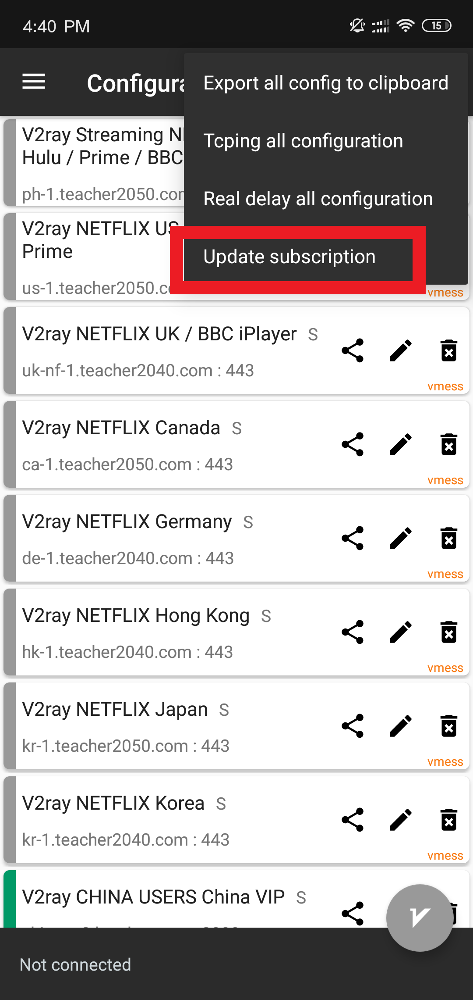
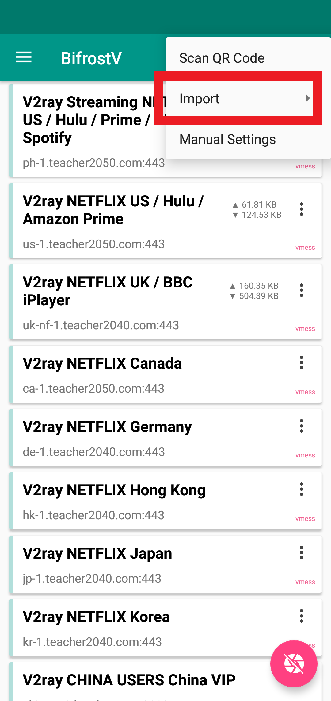
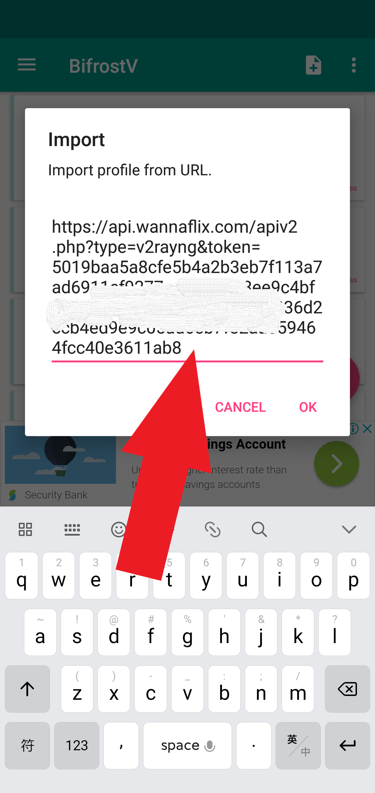
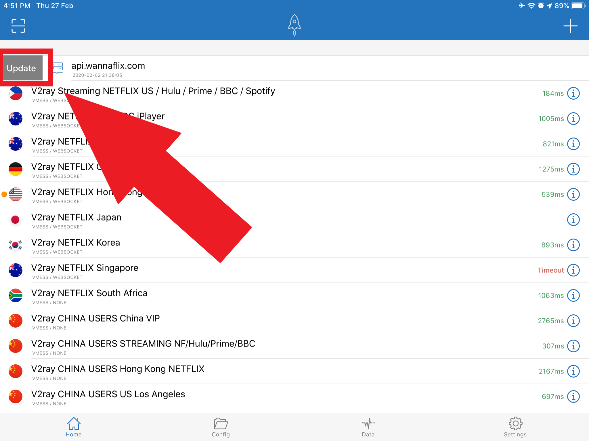

# Updating the Server List

## WINDOWS

## Netch

Tap the Subscription button, and then tap " Update servers from subscription links"

### V2rayNG

1. Open V2rayNG
2. Go to Subscription &gt; Update Subscription

### Clash for Windows

1. Open Clash
2. Go to the "Profiles" tab
3. Click on the refresh button under the api link

## MAC OS 

### V2rayU 

1. Navigate to preferences in the drop down menu.
2. Select the ”subsbribe  tab.
3. Push the ”update servers”  blue button.
4. **Now your servers are updated. Once updated, hit the hide logs.**

### ClashX V1.30.1 and above

Go to Config &gt; Remote Config &gt; Update

## ANDROID

### ClashR

Tap on the "Profiles" button, once there tap the three dots next to the "subscription name". Then press the "Update"

### V2rayNG

Tap on the three dots on the top right corner of the screen and tap "update subscription".

### BitfrostV

Tap on the + button on the top right corner of the screen and go to import &gt; import from URL, then paste the api link \(you can get it from the [client area](https://wannaflix.com/clientarea.php). It's the same as V2rayNG's api link\)

## iOS

### Shadowrocket

Pull the api link to the right, and click "update".

