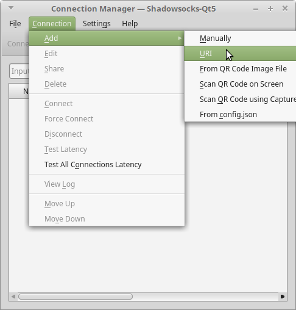

# Shadowsocks-Qt5

## Preparatory Work

First, make sure your system is up-to-date

```text
sudo apt-get update
sudo apt-get upgrade
```

## Download the App

[Click here ](https://github.com/shadowsocks/shadowsocks-qt5/releases/download/v3.0.1/Shadowsocks-Qt5-3.0.1-x86_64.AppImage)to download the AppImage.

Then, open terminal in the download folder and type the following:

```
chmod a+x Shadowsocks-Qt5-3.0.1-x86_64.AppImage
./Shadowsocks-Qt5-3.0.1-x86_64.AppImage
```

If you encounter a  **libstdc++** dependency error when installing, then you need to upgrade your gcc and g++ programs:

```text
sudo add-apt-repository ppa:ubuntu-toolchain-r/test
sudo apt update
sudo apt install gcc-6
sudo apt install g++-6
sudo update-alternatives --install /usr/bin/gcc gcc /usr/bin/gcc-6 60 --slave /usr/bin/g++ g++ /usr/bin/g++-6
```


 This app only works with Ubuntu version 14.04 and above


#### If you want to add the app to your desktop environment, type the following in Terminal:

```text
vim shadowsocks.desktop
```

And type:

```text
[Desktop Entry]
Type=Application
Version=V3.0.1
Encoding=UTF-8
Name=shadowsocks-qt5
Comment=shadowsocks qt application
Icon=shadowsocks
Exec=/home/ddyyll/applications/shadowsocks/Shadowsocks-Qt5-3.0.1-x86_64.AppImage
Terminal=false
StartupNotify=true
Categories=Internet
MimeType=application/shadowsocks
```

Finally, save the file to /usr/share/applications


Icon=shadowsocks is the icon name associated with this application.

Exec=/home/ddyyll/applications/shadowsocks/Shadowsocks-Qt5-3.0.1-x86\_64.AppImage is the location of the downloaded AppImage. Change this to your download location.


## Add the Servers

#### Get the server QR code

1. Login to your [client area](https://wannaflix.com/clientarea.php)
2. Under 'Your subscription', go to 'Manage your VPN subscription'
3. Scroll down. You should see the server list
4. Choose a server you'd like to add. Next to it, there should be a green button labelled "General". Click on it to show the server QR code.

#### Scan the QR code into the App

1. Make sure the QR code remains visible on the screen
2. On the Shadowsocks-Qt5 app, go to Connection &gt; Add &gt; Scan QR code from screen
3. A new server should now be added to the app.



Repeat steps 1 & 2 for each server you want to add.

#### Tweak the settings

The QR code does not contain the local port. Therefore, we need to add it to our server settings. **You need to do this otherwise you won't be able to connect.**

1. Select the server you'd like to edit
2. Right click and select Edit
3. Double check that the local address is set to 127.0.0.1 and local port is set to 1080


## Connect

Right click on the server you want to connect and select "connect"


## Setup Your Browser

Start your browser and navigate to the Proxy Settings section. In this example, Firefox was used. Under the Advanced section, select the Network tab and click on Settings. Select Manual proxy configuration and enter the following:

SOCKS Host: 127.0.0.1  
Port: 1080



For other distributions that are not based on Ubuntu, the installation instructions can be found at [https://github.com/shadowsocks/shadowsocks-qt5/wiki/Installation](https://github.com/shadowsocks/shadowsocks-qt5/wiki/Installation)


## 

 

