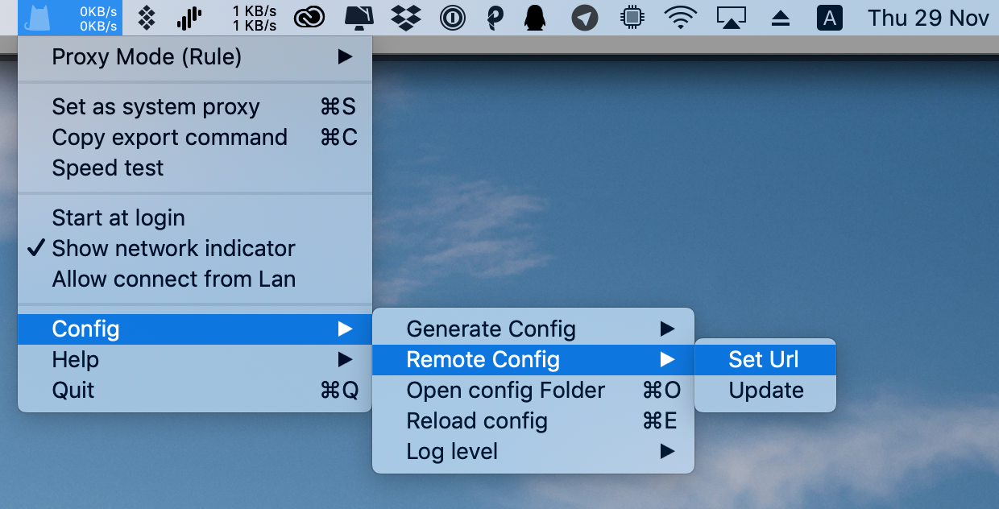
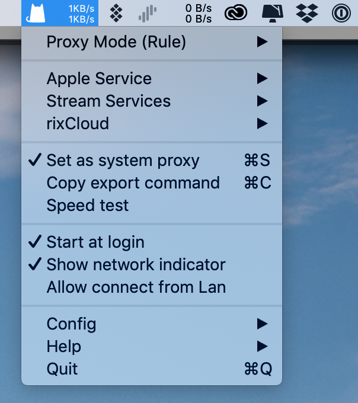

# ClashX

## Installation Environment


This guide was written under...

macOS 10.14.1 

ClashX 1.10.0


## Step 1: Download and Install ClashX

Click [here ](https://wannaflix.com/dl.php?type=d&id=8)to download ClashX

If it is the first time using ClashX, a pop up will appear saying that the app is from an unknown developer. You  need to allow this app to open.

The first time ClashX runs, you will be prompted to install a plugin. This plugin is used to set up the system proxy, otherwise you will need to enter your administrator password each time you connect to the VPN. Click "Install" and macOS will prompt for the user password.

## Copy Your API Link

1. Login to your client area \([https://wannaflix.com/clientarea.php](https://wannaflix.com/clientarea.php)\)
2. Click on "Manage your VPN Subscription" under 'Your Subscription'
3. Under the box "Your Subscribe Links", click on the "Clash API Link" button to copy your link to the clipboard


This subscription link is just as important as your password, please keep it secure


## Configuring ClashX

After running ClashX, click the Clash icon \(a kitten\) on the menu bar, and then click “Config – Remote Config – Set Url” in the menu.

A new window will open. Paste your Clash API link and click OK.

If you have pasted the correct link and the network is properly connected to the Wannaflix API, you should see a success message.

Check "Set as system proxy" to enable ClashX and connect to Wannaflix. You can select the server by clicking on Wannaflix and selecting a server from the list. 

We also recommend to check "Start at login" to automatically launch the ClashX application at boot time.

## If you are upgrading from a previous ClashX version

After updating from the old version of Clash to the 1.10.0 version, you will see the following error:

This is a known bug with the current version of clash. It's not related to the Wannaflix configuration API. 

To solve this, click the ClashX icon in the status bar and select "Configure" - "Open Configuration Folder".

Delete the config.yaml file in the open Finder window.

Then exit and restart the ClashX application.

