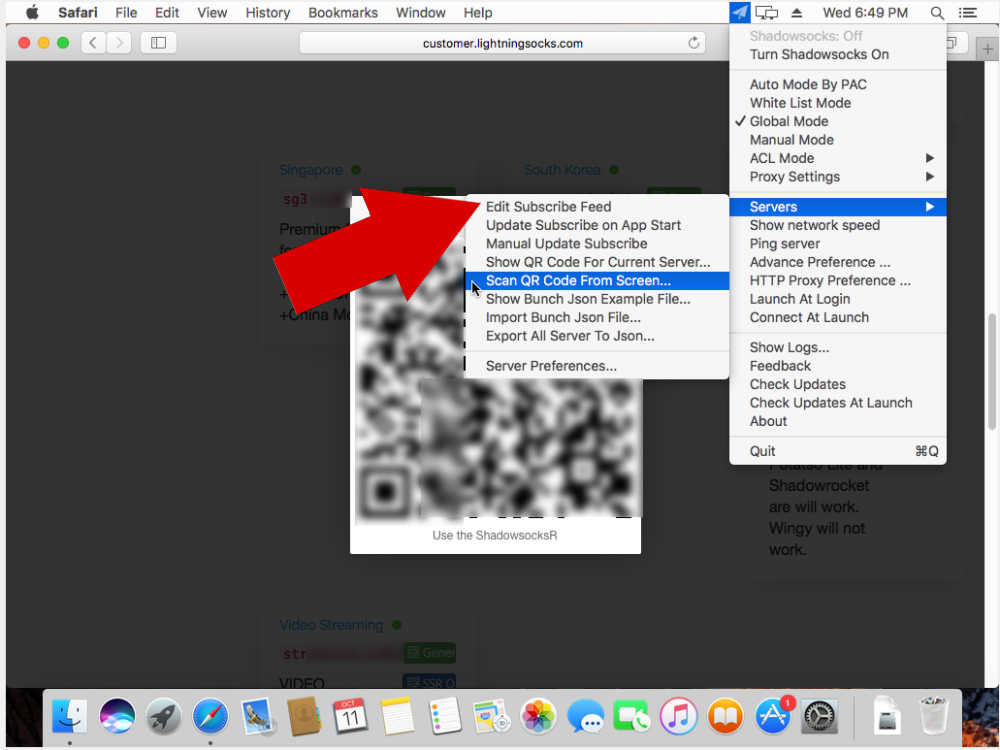
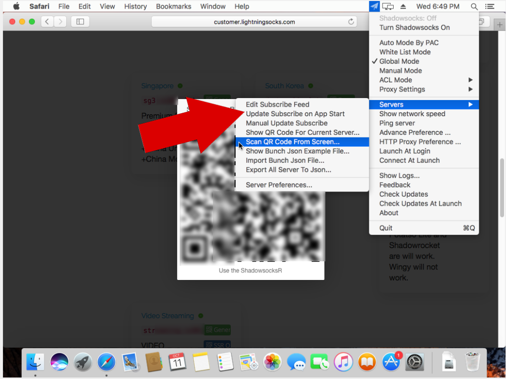
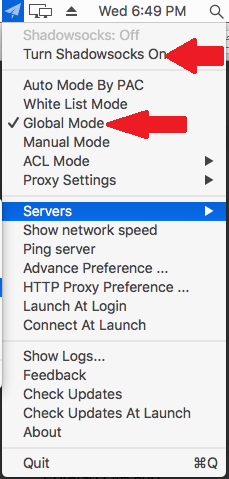

# ShadowsocksX-NG (Recommended)

## Download the App

[Click here](https://wannaflix.com/dl.php?type=d\&id=2) to download the app.

## Install the App

If you get an error that says the app can't be opened because it's from an unidentified developer, follow these steps.

1. Hold down the **Control key** on your keyboard while you click the application icon and then choose **Open** while still holding down the Control key.
2. Choose **Open**

After you open the app, you will see an icon near the top of the screen that looks like a small paper airplane.

## Add the Servers

1. Login to your client area ([https://wannaflix.com/clientarea.php](https://wannaflix.com/clientarea.php))
2. Click on the "Copy Link" button to copy your link to the clipboard
3. After you open the app, you will see an icon near the top of the screen that looks like a small paper airplane.
4. Click on the airplane icon and go to server ---> Edit subscribe feed

6\. Paste the subscribe link you copied into the "subscribe feed" box and click save

7\. Click on the airplane icon again and go to server ---> Update Subscribe on App start, then click on server ---> Manual update subscribe to get the server list.

## Connect

1. Select a server (under Servers)
2. Change the mode to **Global Mode**
3. Select "Turn Shadowsocks On"

