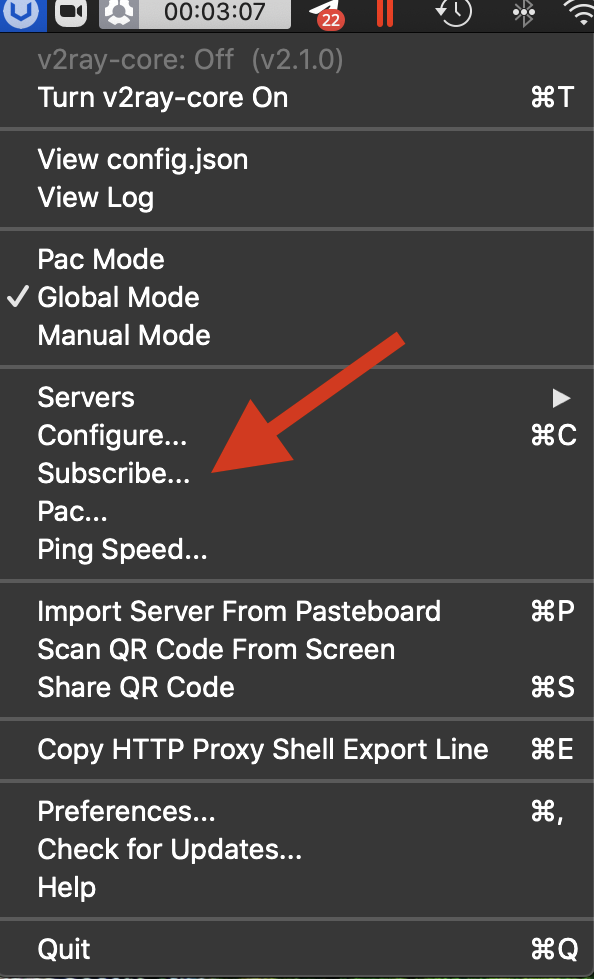

# V2rayU 3.2.0 and Higher

Updated: August 5, 2022


**THIS APP IS NO LONGER SUPPORTED!**

**THIS APP IS NO LONGER SUPPORTED!**

**THIS APP IS NO LONGER SUPPORTED!**



IMPORTANT: v2rayU is extremely unstable on M1 Macs. If you have M1, please use [Shadowrocket](../../mac-os/shadowrocket-m1-macs-only.md) instead. Shadowrocket supports the new VLESS+XTLS protocol as well.



V2rayU 3.2.0+ now supports the new VLESS+XTLS protocol!



System requirements:

* MacOS 10.12+


## Download and install

[Click here](https://wannaflix.com/dl.php?type=d\&id=39) to download the app, then run to install.


Alternative mirrors:

Download on [Github](https://github.com/yanue/V2rayU/releases) (download version 3.2.0 or later)


If it is the first time using V2rayU, a pop up will appear saying that the app is from an unknown developer. You will need to allow this app to open.


If for some reason you cannot install the app or the app keeps crashing, please download [ClashX version 1.30.1 and higher](../../mac-os/clashx-v1.30.1-and-higher.md) instead.


## Add the servers

### Get the api link

1. Go to your [client area](https://wannaflix.net/clientarea.php) on our website.&#x20;
2. Select "Mac OS" as your device.
3. Choose"V2rayU" as your VPN type.
4. Copy the link provided.
5. After V2rayU is running, click the V2rayU icon (Circle with a U/V in the middle), and then click the subscribe button. &#x20;

&#x20;                                                                                                  &#x20;

&#x20; 6\.  A new window will open. Click "Add" and paste your V2rayU API link and then click "update servers "      &#x20;

7\. Then click  "hide logs"  ( Repeat everytime servers are updated)

## Start the VPN

1. Click the "V2rayU" icon  on the menu bar, then click "server"
2. Select the server you would like to connect to.

&#x20;      3\. Select "Turn V2ray-core On" (shortcut: command + T)

_YOU ARE NOW CONNECTED_

## Troubleshooting

#### http error - listen tcp 127.0.0.1:1087: bind: address already in use

This is because the port 1087 is already taken by another program on your Mac. You need to go to V2rayU's settings and change the default port it uses to another one.

1. Go to Preferences > Advanced
2. Change the Local Http Listen Port to something else (for example, 1080)
3. Click "save settings"

## Troubleshooting

### The app suddenly stopped working. I can't connect to any servers.

It is possible you are on an older version of v2rayU. Please download the latest version from your client area or from [this link](https://github.com/yanue/V2rayU/releases), and replace your old version with the new one.

