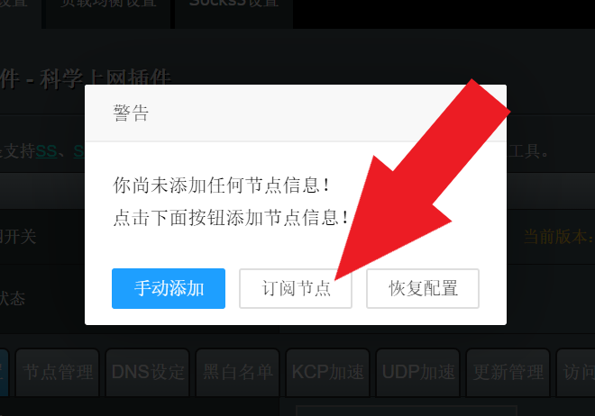

# Merlin-Koolshare Routers


**We do NOT guarantee that our VPN will work with your specific router.**&#x20;

Each router is different. The same model may be flashed with a different version of the OS, and some routers may only support older OS versions which don't work with our App.



**We only support Merlin-Koolshare NOT Vanilla Merlin**

You'll need to flash your router with one of the firmwares in the links below:&#x20;

For Merlin firmware version 380: [https://firmware.koolshare.cn/Koolshare\_Merlin\_Legacy\_380/](https://firmware.koolshare.cn/Koolshare\_Merlin\_Legacy\_380/)

For Merlin firmware version 384: [https://firmware.koolshare.cn/Koolshare\_Merlin\_New\_Gen\_384/](https://firmware.koolshare.cn/Koolshare\_Merlin\_New\_Gen\_384/)


## Recommended routers

We have tested our software with these routers:

### On TaoBao:

[美国linksys XAC1200 5G双频 千兆光纤路由器 EA6200梅林固件包邮](https://item.taobao.com/item.htm?spm=a230r.1.14.20.41cc36fenSDMrH\&id=560789541852\&ns=1\&abbucket=16#detail) Make sure to buy the EA6200 version

### Other Routers:

* **ASUS ROUTERS:** RT-AC56U RT-AC68U RT-AC66U-B1 RT-AC1900P RT-AC87U RT-AC88U RT-AC3100 RT-AC3200 RT-AC5300
* **NETGEAR ROUTERS：**R6300V2 R6400 R6900 R7000 R8000 R8500
* **LINKSYS EA SERIES：**EA6200 EA6400 EA6500v2 EA6700 EA6900
* **HUAWEI ROUTERS:** WS880


Merlin-Koolshare ONLY works with the routers above. If you have a different router, it will not work.


## Flash Merlin-Koolshare

### Preparations

1. Make sure you already have Merlin flashed on your device
2. It is recommended to first update your Merlin firmware to the latest version from your router's manufacturer website or merlin's website before installing KoolShare

### Download the KoolShare firmware

1. Go to [https://firmware.koolshare.cn/Koolshare\_Merlin\_Legacy\_380/](https://firmware.koolshare.cn/Koolshare\_Merlin\_Legacy\_380/)
2. Find your router and download the latest KoolShare version available


For EA6200 router, download the latest 7.9.1 firmware [here](https://wannaflix.com/downloads/EA6200\_380.70\_0-X7.9.1.trx).&#x20;



For Asus routers RT-AC86U and RT-AX88U on firmware version 384, go here instead: [https://firmware.koolshare.cn/Koolshare\_Merlin\_New\_Gen\_384/](https://firmware.koolshare.cn/Koolshare\_Merlin\_New\_Gen\_384/)


### Flash your router with KoolShare

1. Login to your Merlin router
2. Go to Administration > Firmware upgrade
3. Click on "Choose file"
4. Find your downloaded firmware (ends in .trx) and click "Upload"

## **Enable JFFS**

1. Go to Administration > System
2. Enable "Enable JFFS partition", "Format JFFS partition at next boot", and "Enable JFFS custom scripts and configs"
3. Click "Apply" at the bottom of the page
4. Reboot your router

## Install the APP

1. Download [this file.](https://wannaflix.com/downloads/shadowsocks.tar.gz)
2. Login to your router
3. Go to "软件中心" on the left menu
4. Click on the "离线安装" tab at the top (see picture)
5. Click on "Choose File" and select the \[shadowsocks.tar.gz] file you downloaded in step 1
6. Click on "上传并安装"

## Add Your Servers

### Copy your subscribe link

1. Login to your client area ([https://wannaflix.com/clientarea.php](https://wannaflix.com/clientarea.php))
2. Click on "Manage your VPN Subscription" under 'Your Subscription'
3. Under the box "Your Subscribe Links", click on the "Subscribe Link" button to copy your link to the clipboard

### Add your servers

1. Login to your router
2. Go to "软件中心" on the left menu
3. Scroll down and click on the paper airplane icon (see picture)

4\. A popup will appear. Click on "订阅节点" (the button in the middle)

5\. Scroll down and paste your Subscribe Link in the box (see pic)

6\. Set all the settings according to the picture below

7\. Finally, click "保存并订阅"

## Connect to the VPN

1. Select a server from the drop-down menu
2. Toggle the switch at the top of the screen (see picture)
3. Scroll down to the bottom and click "保存&引用"

