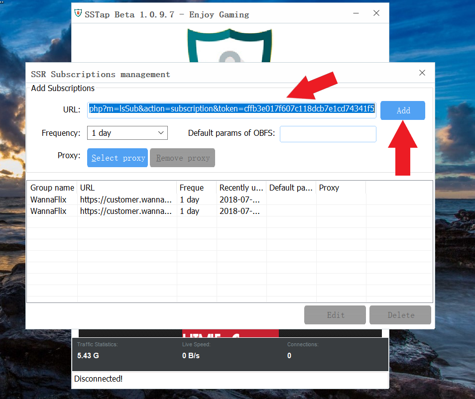

# SSTap

## Download the App

[Click here](https://wannaflix.com/dl.php?type=d&id=5) to download the app.

## Install the App

1. Find and run the downloaded file on your computer
2. A box will appear. Click _"next", "I agree", "Install"_. 
3. When it’s done installing, click _"next"_, and then _"finish"_.


You can usually find the file in your downloads folder


## Add Your Servers

1. Login to your client area \([https://wannaflix.com/clientarea.php](https://wannaflix.com/clientarea.php)\)
2. Click on "Manage your VPN Subscription" under 'Your Subscription'
3. Under the box "Your Subscribe Links", click on the "Subscribe Link" button to copy your link to the clipboard
4. Open the SSTap app on your PC
5. See the cogs icon? Click on it, and go to SSR subscriptions &gt; SSR Subscriptions Management. \(See attachment\)

6. Paste the subscribe link you copied into the URL bar and click Add. Then close the SSR Subscriptions Management box.

7. The app will then attempt to authenticate you. If everything is fine, it will add in your servers to the app.


You have to CLOSE the SSR Subscriptions Management box for it to start downloading the server list to your PC.


## Choose a Server and Connect

Select your preferred server from the dropdown menu and click Connect.


You can always find the app on the task bar or the tray on the bottom of the screen.


