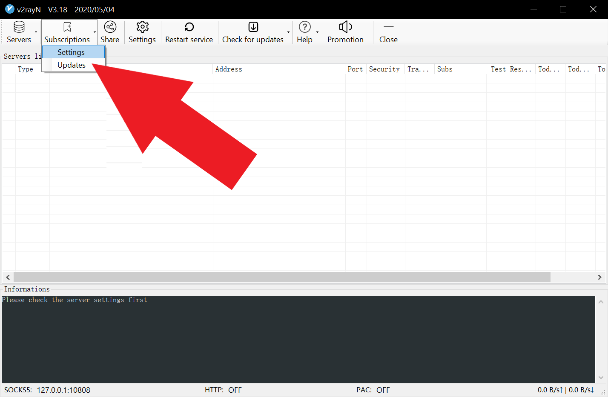
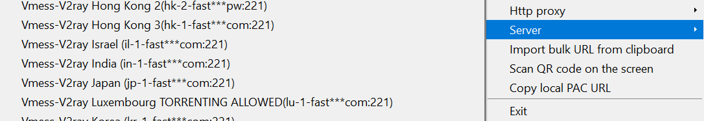
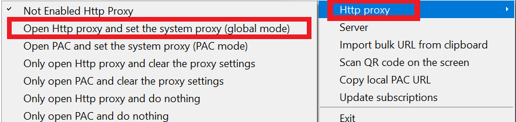

# V2rayN v3.18, v2.50

## Version 3.18 and up (May 11, 2020)

### Download and install

[~~Click here~~](https://wannaflix.com/dl.php?type=d\&id=21) ~~to download the app. It will download it in .ZIP format.~~

**We no longer support the older version.** Please **upgrade** to version 4.12 and up. If you must use this version, please download it from github (see box below).


Alternative mirrors:

Download on [Github](https://github.com/2dust/v2rayN/releases/download/3.18/v2rayN-Core.zip) (it will download as V2rayN-Core.zip instead of V2rayN.zip; look for that filename instead in the next step)


Find the V2rayN.zip file in your download folder. Unzip it (right click > Extract all... ). Then, open the unzipped folder.&#x20;

Double-click on the "V2rayN" file to install.

If there's a pop-up, click "run".


Once installed, you can find the app by searching for "v2rayN" in the search box next to the start menu.&#x20;



You can find V2rayN in the tray at the bottom right corner of your screen.


### Add the servers

#### Get the api link

1. Go to your [client area](https://wannaflix.com/clientarea.php) dashboard
2. Select "Windows" as your device type
3. Choose "V2ray" as your VPN type
4. Copy the api link provided


The API link should start with https://api.wannaflix.com/apiv2.php?type=**v2rayn**


#### Paste the api link into the app

1. Open the app by double clicking on the v2rayN icon (blue V) in the tray on the bottom right corner of your screen.

2\. Go to "Subscriptions" > "Settings"

3\. Click "Add" on the bottom

4\. Paste the API link in the url box

5\. Click OK

.png>)

6\. Go to "Subscriptions" > "Updates"

### Select a server

1. Find the v2rayN icon in the tray again
2. This time, RIGHT CLICK on it
3. Go to "Server" and select a server from the list

### Start the VPN

Right click on the V2rayN icon in the tray (bottom right).

Go to "Http Proxy" > "Open Http proxy and set the system proxy (global mode)"

The v2ray icon should turn **red** when connected.

## Version 2.50 (Nov 13, 2019)


This is the old version of V2rayN. If you've downloaded it before the 11th of May 2020, chances are you are running this version.


### Watch Tutorial Video:

We highly recommend watching the video tutorial. You can stream it in China too.&#x20;


**This is the old video tutorial for version 2.50**




### Download and install

[Click here](https://github.com/2dust/v2rayN/releases/download/2.50/v2rayN.zip) to download the app. It will download it in .ZIP format.

Find the V2rayN.zip file in your download folder. Unzip it (right click > Extract all... ). Then, open the unzipped folder.&#x20;

Double-click on the "V2rayN" file to install.

If there's a pop-up, click "run".


Once installed, you can find the app by searching for "v2rayN" in the search box next to the start menu.&#x20;



You can find V2rayN in the tray at the bottom right corner of your screen.


### Add the servers

#### Get the api link

1. Go to your [client area](https://wannaflix.com/clientarea.php) dashboard
2. Select "Windows" as your device type
3. Choose "V2ray" as your VPN type
4. Copy the api link provided


The API link should start with https://api.wannaflix.com/apiv2.php?type=v2rayn


#### Paste the api link into the app

1. Open the app by double clicking on the v2rayN icon (blue V) in the tray on the bottom right corner of your screen.

2\. Go to "Subscription" > "Subscription settings"

3\. Click "Add" on the bottom

4\. Paste the API link in the url box

5\. Click OK

.png>)

6\. Go to "Subscription" > "Update Subscription"

### Select a server

1. Find the v2rayN icon in the tray again
2. This time, RIGHT CLICK on it
3. Go to "Server" and select a server from the list

### Start the VPN

Right click on the V2rayN icon in the tray (bottom right).

Go to "Http Proxy" > "Open Http proxy and automatically configure proxy server (Global mode)"

The v2ray icon should turn **red** when connected.

