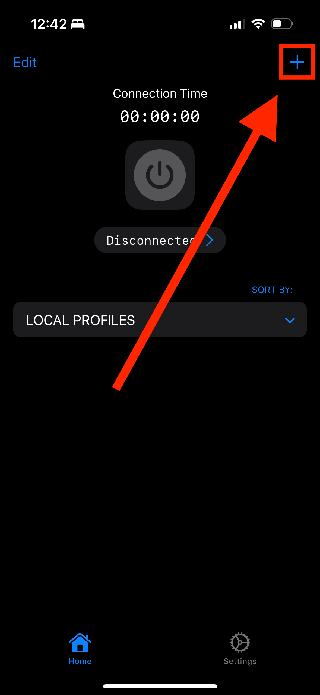
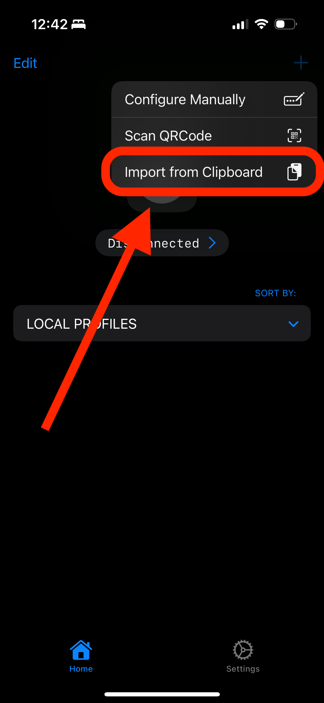
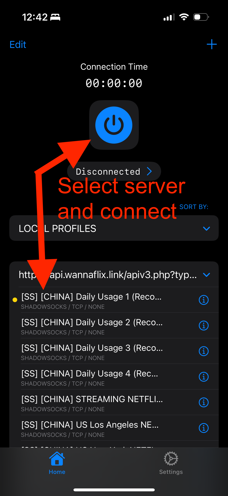
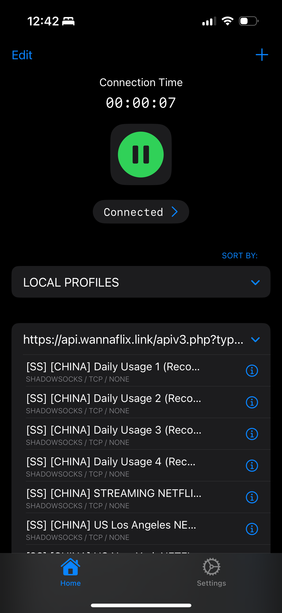
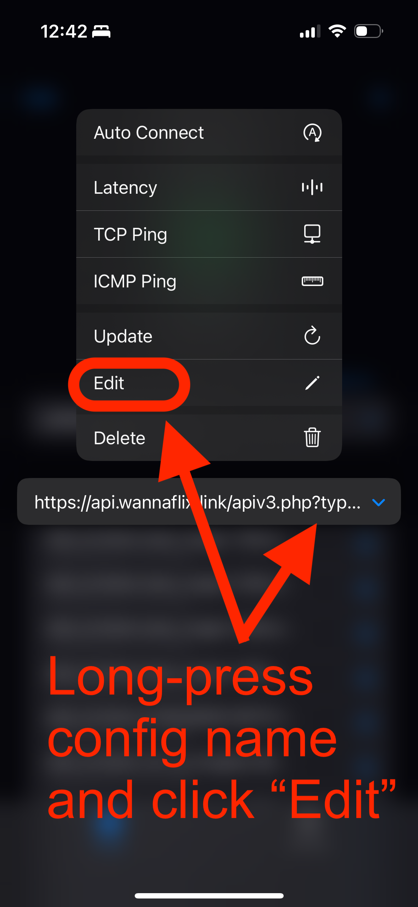
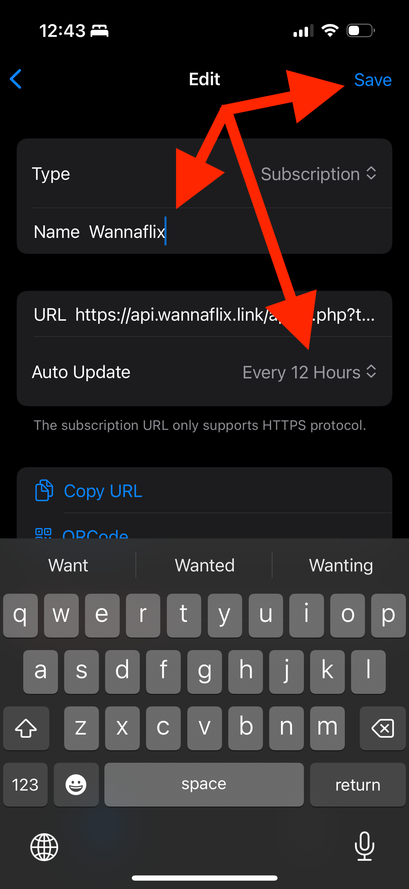

# Streisand

Updated: May 1, 2025


Streisand is the recommended app for iOS. It is easy to setup.&#x20;


## STEP 1: Download Streisand

[Click here](https://apps.apple.com/us/app/streisand/id6450534064) to be redirected to the App Store app. Download it there.

## STEP 2: Import Your Config

### Get the api link

1. Login to your [client area](https://wannaflix.com/clientarea.php) dashboard
2. Select "Streisand" from the iOS Setup dropdown menu
3. Click the "Copy API" button

### Paste the api link into the app

1. Open the Streisand app.
2. Click on the "+" icon on the top right corner.
3. Click on the "Import from clipboard" button&#x20;

<figure><figcaption></figcaption></figure>

<figure><figcaption></figcaption></figure>

## **STEP 3: Connect**

1. Select a server from the server list
2. Click the round button at the top to connect

<figure><figcaption></figcaption></figure>

3. If it is the first time setting up the app, it may ask you to allow the creation of a VPN profile. Click allow and enter your pin/touch ID/face ID.
4. Otherwise, you will be connected.

<figure><figcaption></figcaption></figure>

To diconnect, click the round button again.&#x20;

## Step 4: Enable Server Auto-Update


This updates the server list twice a day so you have the latest configs available at all times


1. Long press the config name (Likely starting with https://api.wannaflix....)
2. Click "Edit"
3. Set the Name to "Wannaflix"
4. Set Auto Update to "Every 12 Hours"&#x20;
5. Click Save

<figure><figcaption></figcaption></figure>

<figure><figcaption></figcaption></figure>

***

## Advanced Options&#x20;

### Split-tunneling

1. Copy one of the routing rules in the box below
2. Click on the "+" icon on the top right corner.
3. Click on the "Import from clipboard" button&#x20;
4. Still in the Streisand app, go to Settings > Routing
5. Select the config "China Mainland Bypass", and toggle the Enable switch


### Routing Rules

**China Mainland Bypass:** Bypass Chinese websites and apps, as well as apple services

`streisand://aW1wb3J0L3JvdXRlOi8vWW5Cc2FYTjBNRERUQVFJREJBVUdWRzVoYldWVWRYVnBaRlZ5ZFd4bGMxOFFGVU5vYVc1aElFMWhhVzVzWVc1a0lFSjVjR0Z6YzE4UUpFRTRRekV5UVRSQkxUQkRORVV0TkVORU55MUJSRVpHTFVJelJEVkNSREkwUkVZMU9hTUhEUkhTQ0FrS0RGWmtiMjFoYVc1YmIzVjBZbTkxYm1SVVlXZWhDMXBuWlc5emFYUmxPbU51Vm1ScGNtVmpkTklPQ1E4TVVtbHdvUkJZWjJWdmFYQTZZMjdURWdnSkV4UU1YV1J2YldGcGJrMWhkR05vWlhKV2FIbGljbWxrb1JWZFoyVnZjMmwwWlRwaGNIQnNaUWdQRkJrZk4xNWlaMjU2ZkllT2s1YVlvYWkydmI4QUFBQUFBQUFCQVFBQUFBQUFBQUFXQUFBQUFBQUFBQUFBQUFBQUFBQUF6UT09`



### First time setting up routing rules?

Make sure the website and IP databases are updated

1. Go to Settings > Routing&#x20;
2. Click the Settings button, then Assets
3. Enable "Auto Update" and click "Update All"


