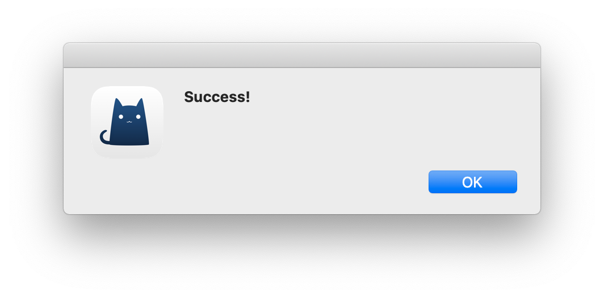
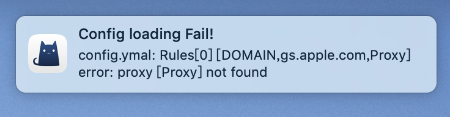
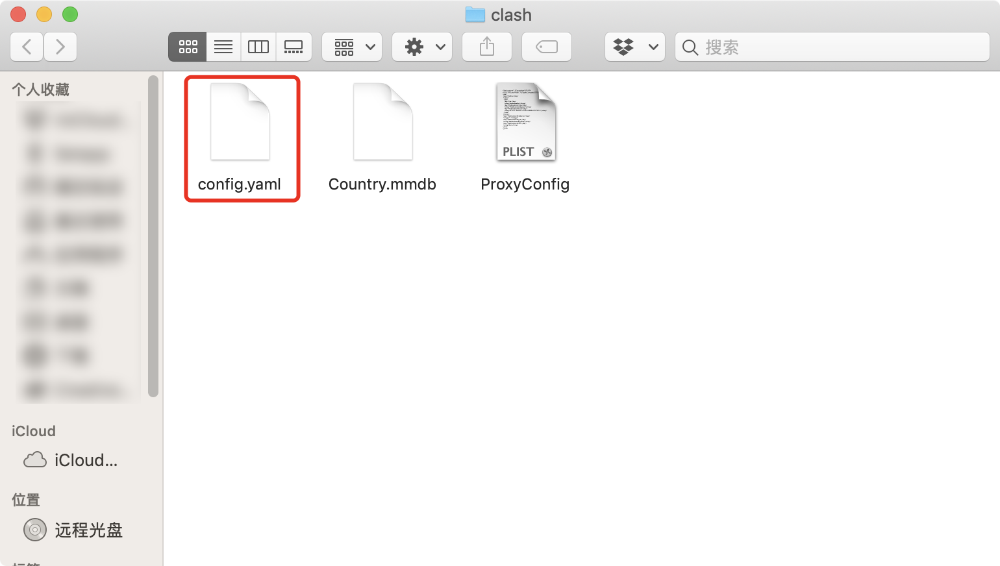

# ClashX v1.30.1 and Higher

Updated: April 17, 2024


**IMPORTANT**

**We no longer support versions under 1.30.1. Please update to the latest version if you are running a version older than 1.30.1.**



If you have an M1 Mac, [OneClick](oneclick-m1-macs-only-recommended.md) is a good alternative.


## Watch Tutorial Video:

The video tutorial may be easier to follow. You can stream it in China too.

[Video](https://watch.cloudflarestream.com/5ceac0d642744c812af04af1942cc332)

## STEP 1: Download and install

[Click here](https://cdn-edge.wannaflix.net/ClashX\_1.118.1.1.dmg) to download the latest version of the app, then run to install.&#x20;


Version: 1.118.1.1

Released: October 16, 2023

Supports all M-series Macs


If it is the first time using ClashX, a pop up will appear saying that the app is from an unknown developer. You need to allow this app to open.

The first time ClashX runs, you will be prompted to install a plugin. This plugin is used to set up the system proxy, otherwise you will need to enter your administrator password each time you connect to the VPN. Click "Install" and macOS will prompt for the user password.

## STEP 2: Add the servers

### Get the api link

1. Go to your [client area](https://wannaflix.com/clientarea.php) dashboard
2. Click on the dropdown menu under "Setup for Mac OS" and select ClashX for MacOS
3. Copy the API you want to use. If it is your first time, we recommend copying the "Basic API". If you want to use the split tunneling feature of Clash, copy the "Advanced API".&#x20;


Basic API - tunnel all websites through the same server. **Should satisfy most users.**&#x20;

Advanced API - option to choose different servers for different services (like Netflix, Disney+, etc.)

Subconverter API - only use this API if you know how to configure the subscription converter. **Only for niche users.**


### Paste the API

1. After running ClashX, click the Clash icon (a kitten) on the menu bar, and then click Config > Remote Config > Manage in the menu.

2\. A new window will open. Click "Add", paste your Clash API link and click OK.

 

If you have pasted the correct link and the network is properly connected to the Wannaflix API, you should see a success message.


If you do not see this message, check that you have an internet connection and an active subscription.&#x20;

You can also try to manually update it by going to Config > remote config> update



**RECCOMENDATION:** Set the subscription to auto update by going to Config > remote config > auto update


## STEP 3: Start the VPN

### OPTION 1: Basic API - Global Mode

1. Select Proxy Mode: Rule
2. Under WannaFlix, choose a server from the list
3. Check "Set as system proxy" to enable ClashX and connect to Wannaflix.&#x20;

<figure><figcaption></figcaption></figure>

### OPTION 2: Advanced API - Rule Mode

1. Select Proxy Mode : Rule
2. Under WannaFlix, chose a server from the list
3. Check "Set as system proxy" to enable ClashX and connect to Wannaflix.&#x20;

You can select the server by clicking on WannaFlix and selecting a server from the list.&#x20;

## STEP 4: Additional recommendations


We also recommend to check "Start at login" to automatically launch the ClashX application at boot time.



If you are using ClashX **Pro**, you can enable "Enhanced Mode" in the dropdown menu for better stability (i.e. app support).


## \[OPTIONAL READ] If you already have ClashX

Please re-download the app from the link above. It's an updated version. Older versions may not work.

After updating from the old version of Clash to the new version, you may see the following error:

This is a known bug with the current version of clash. It's not related to the Wannaflix configuration API.&#x20;

To solve this, click the ClashX icon in the status bar and select "Configure" - "Open Configuration Folder".

Delete the config.yaml file in the open Finder window.

Then exit and restart the ClashX application.

## Troubleshooting

No common issues.&#x20;

Please submit your issues to our telegram group chat. We will update this section with the most common issues.

