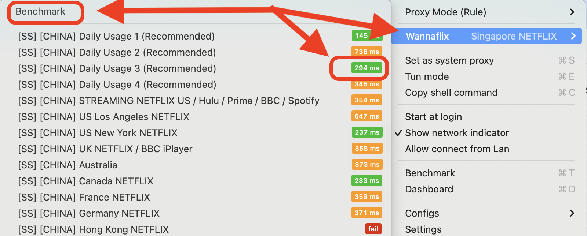

# ClashX.Meta

Updated: May 1, 2025


### App recommendations

If you have an M1 Mac, we recommend [OneClick](oneclick-m1-macs-only-recommended.md) for ease of use instead.



### ClashX.Meta version 1.4.12 and up (April 2025 release).&#x20;

ClashX.Meta **version 1.4.12 and up** supports all major protocols, and works with all our servers. It also supports the TUN engine for capturing all app traffic.

ClashX.Meta is a continuation of the previous app, ClashX Pro. ClashX Pro is no longer updated, so we recommend switching to ClashX.Meta or OneClick instead.


## STEP 1: Download and install ClashX


### Version: v1.4.12

[**Click here**](https://wannaflix-sz-edge.b-cdn.net/clash/macos/ClashX.Meta.zip) **to download the app.**&#x20;

Alternative mirrors:

* Download on [Github](https://github.com/MetaCubeX/ClashX.Meta/releases)&#x20;


### Install the Application

1. Double-click the `.zip` file. It will extract/unzip the application&#x20;
2. Double-click `ClashX Meta`

#### Allow ClashX.Meta to run on your Mac

If you encounter a warning stating that the app cannot be opened because **Apple cannot check it for malicious software**, follow these steps:

1. Go to **System Settings > Privacy & Security**.
2. Click **"Open Anyway"** next to the warning about ClashX.Meta.
3. Confirm by clicking **"Open"** in the subsequent dialog.

<figure><figcaption></figcaption></figure>

<figure><figcaption></figcaption></figure>


### Source

[https://support.apple.com/guide/mac-help/apple-cant-check-app-for-malicious-software-mchleab3a043/mac](https://support.apple.com/guide/mac-help/apple-cant-check-app-for-malicious-software-mchleab3a043/mac)


### **Launch ClashX**

* Open `ClashX Meta`&#x20;
* Upon first launch, the app may prompt you to install a helper tool to manage system proxy settings. Click **"Install"** and provide your administrator password when prompted.​

You will find the ClashX.Meta icon (a big letter M) in the menu bar (top of the screen).

<figure><figcaption></figcaption></figure>


## TIP

If ClashX.Meta runs without any error but you **don’t see the icon in the menu bar**, it’s likely because your menu bar is too full.

Try **quitting a few other apps** to free up space — the icon should then appear automatically.



### App Icon

The app icon is a big M.

You will find the app in the menu bar at the top right of your screen.




## TIP: Launching ClashX.Meta

You can easily find **ClashX.Meta** again through **Spotlight Search:**

1. Press `⌘ + Space` to open **Spotlight**.
2. Type `ClashX Meta`.
3. Selecting the app from the search results and pressing `Enter` to launch it.

This is a quick way to reopen it without navigating through your folders.


## STEP 2: Import your config

### Copy the API

1. Login to your [client area](https://wannaflix.com/clientarea.php) dashboard
2. Select "ClashX Meta" in the dropdown for MacOS
3. Click "Copy API"


### Different API types:

* **Simple API**: One proxy group, easy to set up, suitable for basic use. _**Recommended for new users.**_
* **Split-tunneling API**: Supports multiple proxy groups and service-based routing for advanced control.
* **Subconverter API**: A technical tool for advanced users to convert and customize subscription configs across different formats (Clash, Surge, etc.). \[Only if you know what it is]


### Paste the API&#x20;

1. Open **ClashX Meta** by clicking on the icon at the top of your screen
2. Go to **Config > Remote Config > Manage**.
3. Click **Add**, paste your **subscription URL**, and name it.
4. Click **OK**, then select and **Update** the config.

<figure><figcaption></figcaption></figure>

Your server list has now been downloaded to the app.

## STEP 3: Select a server and connect

### OPTION 1: Simple API


### Recommended setup for new users

If you see a different setup that the screenshots, check that you got the correct config API from our website


1. Click on `Wannaflix`
2. Click `Benchmark` and then select a server with a number next to it
3. Make sure `Proxy Mode` is set to `Rule`, and select `Set as system proxy`

<figure><figcaption></figcaption></figure>

<figure><figcaption></figcaption></figure>

### OPTION 2: Split-tunneling API - decide which server each site will go through


### Setup for advanced users

If you don't need split-tunneling, we recommend sticking to the Simple API setup above


1. Click on `Wannaflix`
2. Click `Benchmark` and then select a server with a number next to it
3. Make sure `Proxy Mode` is set to `Rule`, and select `Set as system proxy`

<figure><figcaption></figcaption></figure>

<figure><figcaption></figcaption></figure>


### What are modes?

Rule - **Recommended.** Choose this option if you are in China. Websites go to different servers based on pre-configured rule sets.&#x20;

Global - All websites go through one Wannaflix server. Can cause Chinese sites to malfunction. Only choose this option if you are **NOT** in China.&#x20;

Direct - **Don't enable**. (Disables the VPN).

NOTE: If you are using the SIMPLE API, Rule mode does split tunneling for Chinese and foreign sites automatically (Chinese sites connect directly, not through the VPN, and overseas sites go through the VPN).



### Configure split tunneling (Optional)

1. You'll see a list of different groups(like `Wannaflix`,  `🍎 Apple`, or `📺 Netflix`)
2. Click on the **group** name (e.g., `📺 Netflix`)
3. Select the desired server from the list (e.g., 🇯🇵 Japan, 🇸🇬 Singapore, etc.)
4. &#x20;That service will now go through your selected server.&#x20;


### You are now connected.


### How to disconnect

Unselect "Set as system Proxy"&#x20;



Make sure to **turn the "System Proxy" switch OFF before quiting the app** or you won't have any internet if you do so (i.e. it doubles as a kill-switch).

To fix it, restart the app and turn the "System Proxy" switch OFF and then quit the app.


&#x20;                                     _**`END OF SETUP`**_                                      &#x20;

***

## FYI \[IMPORTANT READ]

### If you want to play games with Clash or have all apps go through Clash, you need to use TUN Mode instead of System Proxy

1. Click the **ClashX Meta** icon in the menu bar.
2. Select **TUN Mode**.
3. Make sure **“Set as system proxy”** is **unchecked**, since TUN handles routing directly.


When TUN mode is enabled, there is no need to enable system proxy.


<figure><figcaption></figcaption></figure>

## FAQ

### How can I update the server list?

Go to **Config > Remote Config > Update**

### How can I play games with ClashX?

You need to use Tun Mode (see above), and connect to a server that supports UDP.

### Netflix/other website is using another server to connect instead of the one I selected.

You have probably selected "Rule" mode and the Netflix website is being redirected to another server based on the Netflix rule set. Select the server you want under "Netflix" in the server list.
