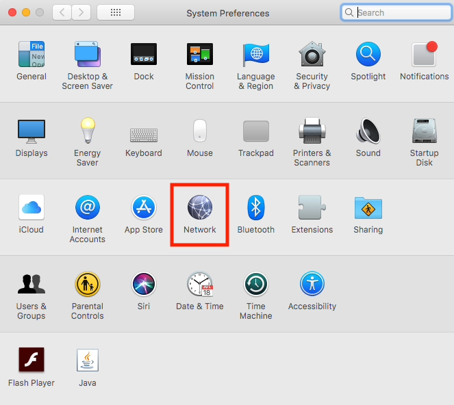
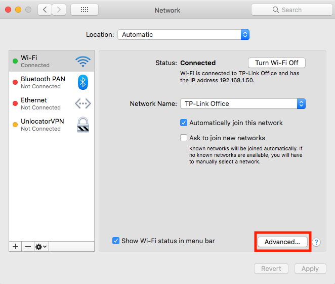
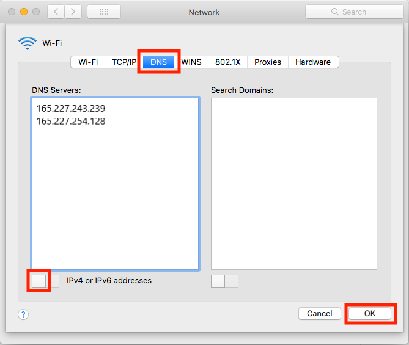

# SmartDNS


Using the VPN will automatically disable your local SmartDNS settings. Please choose either the one or the other.


## Register your IP address and choose your prefered Netflix region

1. Login to your client area \([https://wannaflix.com/clientarea.php](https://wannaflix.com/clientarea.php)\)
2. Click on your active SmartDNS subscription
3. Select your prefered Netflix region and click "Update"


You will have to re-submit your IP address each time it changes \(router reboots, new location, etc.\)


## Change your local DNS settings

1. Open up System Preferences and find Network 

2. Then select either Wi-Fi or Ethernet depending on the method you use to connect to the Internet. 

3. Once selected click the advanced button on the lower right-side 

4. Then select "DNS" 

5. Click the small plus on the lower left hand side 

6. Add **165.227.243.239** and **165.227.254.128** 

7. Remove any other DNS address 

8. Click OK 

9. Then click Apply 

10. Restart your computer

