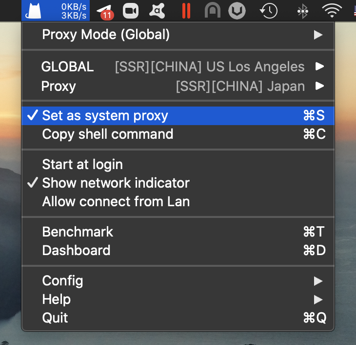
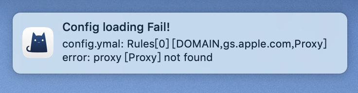
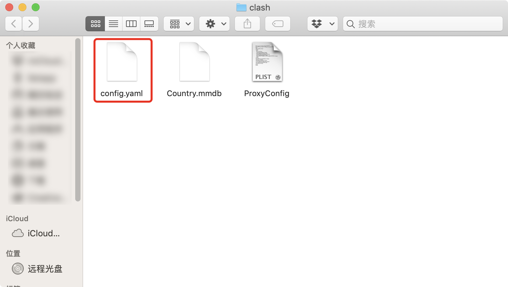

# ClashX v1.30.1 and Higher

Updated: **** August 13, 2021


**IMPORTANT**

**We no longer support versions under 1.30.1**


## Watch Tutorial Video:

We highly recommend watching the video tutorial. You can stream it in China too.

[Video](https://watch.cloudflarestream.com/5ceac0d642744c812af04af1942cc332)

## Download and install

[Click here](https://wannaflix.com/dl.php?type=d\&id=36) to download the app, then run to install. ****&#x20;


Version: 1.65.1.1

Released: August 13, 2021

Native M1 Mac support



Alternative mirrors:

Download via [App Center](https://install.appcenter.ms/users/clashx/apps/clashx-pro/distribution\_groups/public) (ClashX PRO v1.65.1 and up)

Download on [Github](https://github.com/yichengchen/clashX/releases/download/1.20.0/ClashX.dmg) (version 1.30.1 and up)


If it is the first time using ClashX, a pop up will appear saying that the app is from an unknown developer. You need to allow this app to open.

The first time ClashX runs, you will be prompted to install a plugin. This plugin is used to set up the system proxy, otherwise you will need to enter your administrator password each time you connect to the VPN. Click "Install" and macOS will prompt for the user password.

.png>)

## Add the servers

### Get the api link

1. Go to your [client area](https://wannaflix.com/clientarea.php) dashboard
2. Under the "API LINKS" box, click "Mac OS ClashX" to copy the API

### Paste the API

1. After running ClashX, click the Clash icon (a kitten) on the menu bar, and then click “Config – Remote Config – "Manage" in the menu.

2\. A new window will open. Paste your Clash API link and click OK.

If you have pasted the correct link and the network is properly connected to the Wannaflix API, you should see a success message.

## Start the VPN

1. Select Proxy Mode : (Global)
2. Under GLOBAL, chose a server from the list
3. Check "Set as system proxy" to enable ClashX and connect to Wannaflix.&#x20;

You can select the server by clicking on Wannaflix and selecting a server from the list.&#x20;


We also recommend to check "Start at login" to automatically launch the ClashX application at boot time.


## If you already have ClashX

Please re-download the app from the link above. It's an updated version. Older versions may not work.

After updating from the old version of Clash to the new version, you may see the following error:

This is a known bug with the current version of clash. It's not related to the Wannaflix configuration API.&#x20;

To solve this, click the ClashX icon in the status bar and select "Configure" - "Open Configuration Folder".

Delete the config.yaml file in the open Finder window.

Then exit and restart the ClashX application.

## Troubleshooting

To be done...

Please submit your issues to our telegram group chat. We will update this section with the most common issues.

