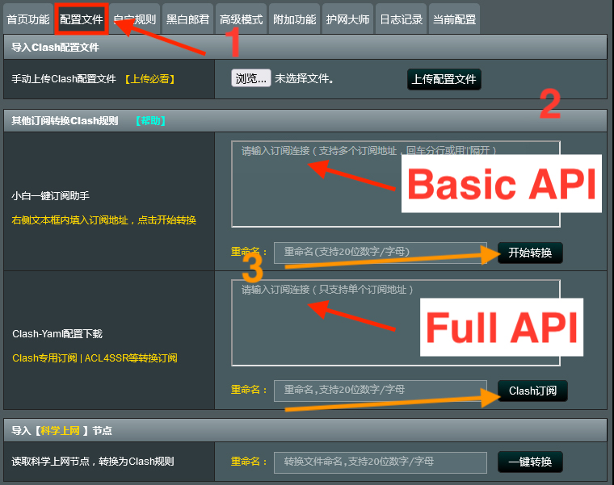
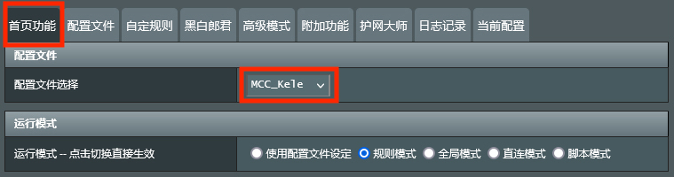
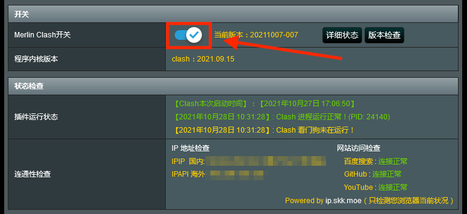
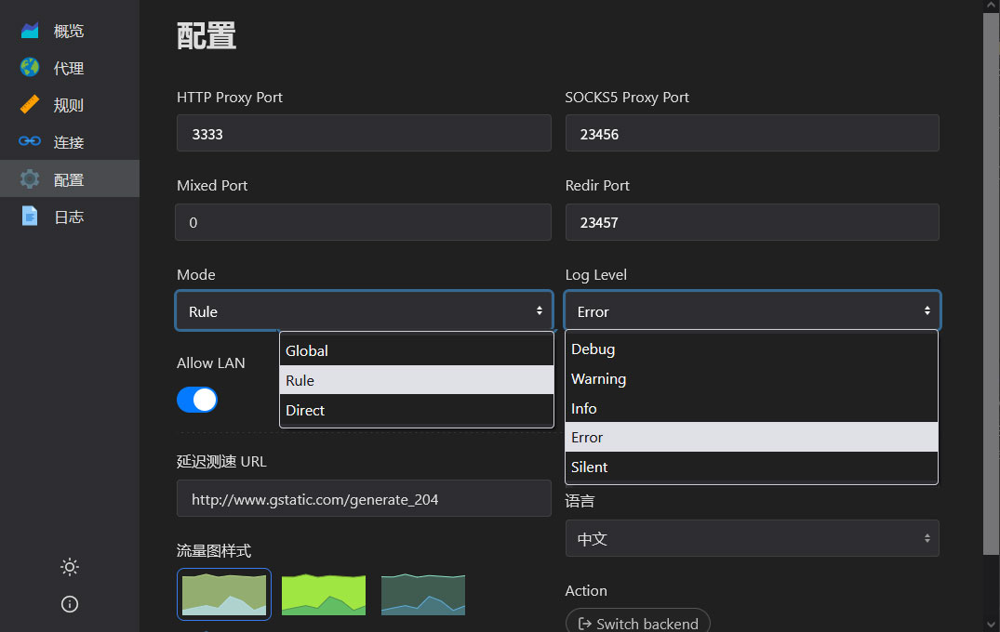

# MerlinClash

## Disclaimer


**We do NOT guarantee that our VPN will work with your specific router.**&#x20;

Each router is different. The same model may be flashed with a different version of the OS, and some routers may only support older OS versions which don't work with our App.



**This guide is provided on a best-effort basis.** There are too many variables to write an exhaustive guide that will work with all routers.&#x20;

We provide you with links to external documentation and resources. Please refer to them if you get stuck. Most likely the issue you are facing has been addressed in those guides.&#x20;



**We do NOT provide extensive customer support for routers.**

We only support routers listed in this guide below.

We only provide support for the **configuration** of the Merlin Clash app:

* Where to put the API link and how to update it.
* How to setup DNS to prevent DNS poisoning.
* How to connect to a specific server.

We do NOT provide ticket support for:

* Flashing your router
* Installing the Merlin Clash app on the router&#x20;
* Exception: If links in this guide are no longer working, you can open a ticket with us to get working links.

However, we do provide this guide in English, as well as links to other resources you can read should you need more info.



**We only support Merlin-Koolshare NOT Vanilla Merlin**

You'll need to **flash your router** with one of the firmwares in the links in this guide below.



Additional resources:

[~~FancySS Github~~](https://github.com/hq450/fancyss) ~~- V2ray app repository, links to Merlin-Koolshare download locations \[OUTDATED, DOES NOT WORK]~~

[V2ray\_bin Github](https://github.com/cary-sas/v2ray\_bin) - Latest v2ray app repository for Merlin Koolshare 380

[Merlin Clash Docs ](https://mcreadme.gitbook.io/mc/)- Clash for Merlin, for those with Merlin Koolshare 384 and 386

[Merlin-Koolshare kernels](https://fw.koolcenter.com) - All available Merlin-Koolshare kernel downloads


Alright! With that out of the way, let's get started!

## Buying Your Router

The Merlin Clash app for Merlin is part of the fancyss app package. It can only be run on a customized version of Merlin, Merlin-Koolshare.

Therefore, you'll need to get a router that can be flashed with Merlin-Koolshare (or that comes with it pre-installed).&#x20;


#### Overview:

1. Purchase a router that can run Merlin-koolshare
2. Flash it with Merlin-Koolshare
3. Download and install the FancySS app package


### Routers


Please only purchase routers listed below


Please find the supported routers list here: [https://fw.koolcenter.com/KoolCenter\_Merlin\_New\_Gen\_386](https://fw.koolcenter.com/KoolCenter\_Merlin\_New\_Gen\_386)


If the link above doesn't work, go to [https://fw.koolcenter.com/](https://fw.koolcenter.com/) and click on the highest version of "Koolcenter" (i.e. [KoolCenter\_梅林改版固件\_386【新】](https://fw.koolcenter.com/KoolCenter\_%E6%A2%85%E6%9E%97%E6%94%B9%E7%89%88%E5%9B%BA%E4%BB%B6\_386%E3%80%90%E6%96%B0%E3%80%91/))



If you don't have a router listed in the links above, please do NOT continue with the guide. It will not work.


## Flashing your router

Once you've bought your router, you'll need to flash it with Merlin-Koolshare.

### Preparations

1. Make sure you already have Merlin flashed on your device
2. It is recommended to first update your Merlin firmware to the latest version from your router's manufacturer website or merlin's website before installing KoolShare.

### Download the KoolShare firmware

Find which version of Fancyss your router supports from the router list above.

1. #### **Find your router in the list and click on it:** [https://fw.koolcenter.com/KoolCenter\_Merlin\_New\_Gen\_386](https://fw.koolcenter.com/KoolCenter\_Merlin\_New\_Gen\_386)
2. #### Download the latest version of the firmware

### Flash your router with KoolShare 

1. Login to your Merlin router
2. Go to Administration > Firmware upgrade
3. Click on "Choose file"
4. Find your downloaded firmware and click "Upload"

## **Enable JFFS** 

Next, we need to enable JFFS to be able to upload MerlinClash to our router.

1. Go to Administration > System
2. Enable "Enable JFFS partition", "Format JFFS partition at next boot", and "Enable JFFS custom scripts and configs"
3. Click "Apply" at the bottom of the page
4. Reboot your router

## Install the APP (MerlinClash) 

First, you need to download the correct version of MerlinClash for your router.&#x20;

You will need a telegram account to access the telegram group where the files are posted.&#x20;

**Join the group:** [**https://t.me/merlinclashcat**](https://t.me/merlinclashcat)****

Then find the latest file for your router. You will need to know the CPU type of your router.

**KoolCenter（KoolShare）Firmware：**

<mark style="color:blue;">ARM v8 HND版本</mark>       -- For AC86U/GT5300/AX68U/AX86U/AX88U/AX92U/AX1100/RAX80 etc.

<mark style="color:blue;">ARM v7 AX32版本</mark>        -- For AX3000/AX6600/AX82/AX56/AX56Uv2/AX58U/AX89X/RAX50等

<mark style="color:blue;">ARM v7 384/6版本</mark>       --  For routers that run Koolshare vservion 384/386 such as AC68U/AC88U/RT5300 etc.

<mark style="color:blue;">ARM v7 380版本</mark>           --  For ARM v7 routers that run Koolshare version 380

#### Here is the Merlin Clash Wiki (you can use google translate to translate it to english):




**IMPORTANT**

**Once downloaded, you have to rename the file to merlinclash.tar.gz**


### Install **merlinclash**.tar.gz on your router

1. Login to your router
2. Go to "软件中心" on the left menu
3. Click on the "离线安装" tab at the top (see picture)
4. Click on "Choose File" and select the \[shadowsocks.tar.gz] file you downloaded in step 1
5. Click on "上传并安装"


If you get an error message saying that the package is not allowed to be installed, you need to remove the restriction.

1. Enable SSH in Administration > System
2. SSH into your router (you can use [putty ](https://www.putty.org/)on windows, or terminal on Mac) and run the following command:

sed -i 's/\tdetect\_package/\t# detect\_package/g' /koolshare/scripts/ks\_tat\_install.sh

That is one line only.

See [https://hq450.github.io/fancyss/](https://hq450.github.io/fancyss/)


## Add Servers 

### **Copy your API**

1. Go to the website dashboard
2. Under Windows, select "Clash for windows"
3. Copy the basic API for Clash

### **Paste your API into MerlinClash**

1. Go to your Koolshare app center (you can access it from the left-hand menu on Merlin)
2. Click on MerlinClash to open the app
3. Click on "配置文件“, the second tab from the right on the top menu
4. Paste your API in the first box next to "**小白一键订阅助手**"
5. Click **"开始转换"** to download the server list

<figure><figcaption></figcaption></figure>


If you have copied the full Clash API, you'll need to paste it in the second large box next to **"Clash-Yaml配置下载",** then click **"Clash订阅“**


## Connect 

### **Select your config and start MerlinClash**

1. Go back to the first tab "首页功能"
2. Select your Config from the dropdown "配置文件选择"
3. Start Clash by toggling the on/off switch
4. Scroll to the bottom and click **"保存&启动"**

<figure><figcaption></figcaption></figure>

<figure><figcaption></figcaption></figure>

### **Select your server** 

1. Scroll down and select either YACD-Clash or RAZORD-Clash to access the GUI (graphical user interface)
2. Select a server
3. Go to settings and select a Mode (for the Basic API, we recommend using the GLOBAL mode, for the full API, we recommend using the RULE mode). See screenshot for YACD settings.

<figure><figcaption></figcaption></figure>

## Additional resources

MerlinClash official documentation (Chinese) {You can try google translating}: [https://mcreadme.gitbook.io/mc/](https://mcreadme.gitbook.io/mc/)&#x20;
