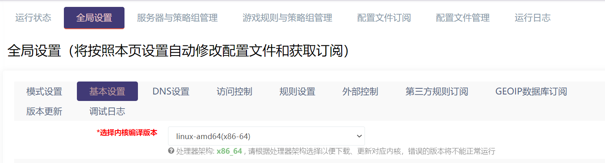
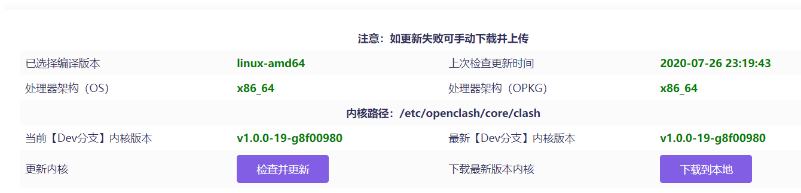
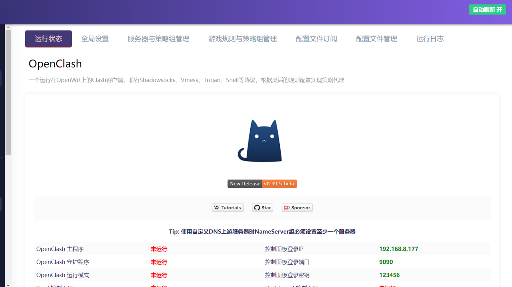
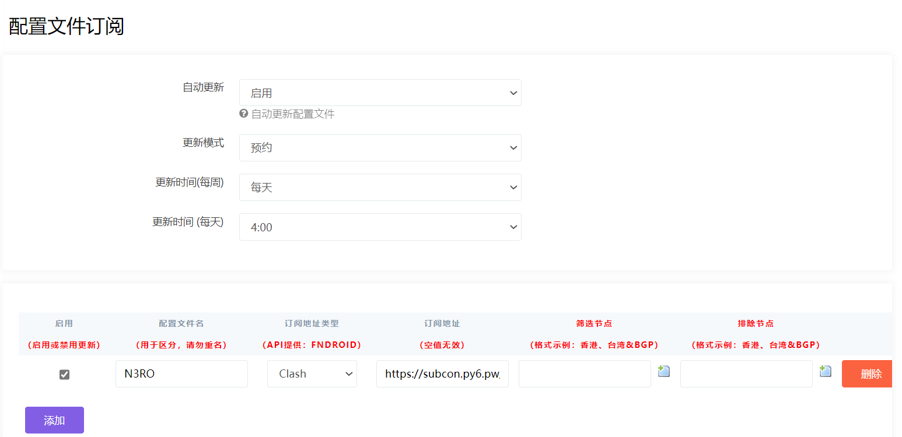
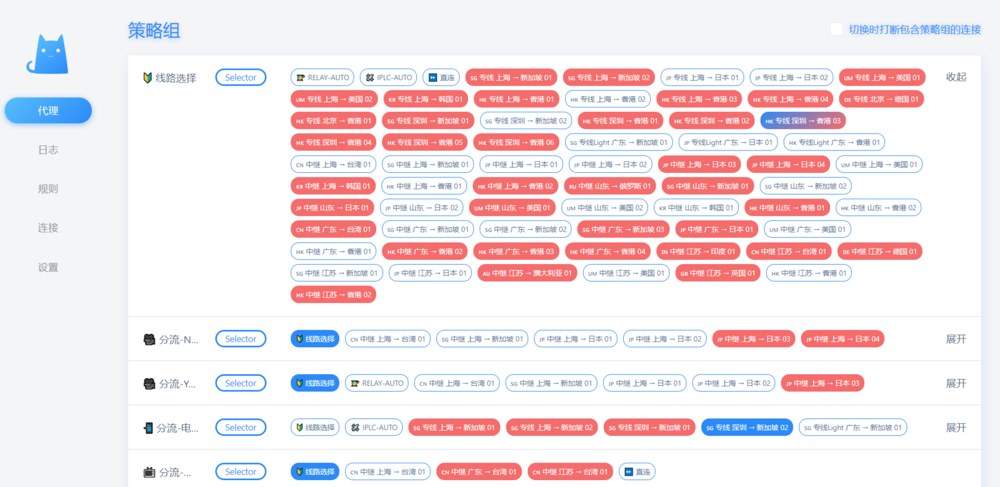

# OpenClash


Many third-party modded OpenWRT designed for the Chinese market are pre-installed with OpenClash. 

To see if your router will be installed with OpenClash, please contact your router provider before buying it.



We only provide instructions on how to setup OpenClsah with WannaFlix. We do not provide instructions on how to install OpenClash on your router if it isn't already installed.


## Initial setup

If it is your first time setting up OpenClash, please do the following:

Login to your OpenWRT router and go to the OpenClash app. Click "Global Settings/全局设置" → "基本设置", then select your CPU architecture from the "Select Kernel Compilation Version/选择内核编译版本" drop-down list, and click "Save Configuration/保存配置".

 Click the "Version Update/版本更新" tab, and click the "Check and Update/检查并更新" button to download the latest Clash kernel.


As long as the Dev version of the Clash kernel can be downloaded, then you can use the basic Clash functions. If you cannot download the Clash kernel, you can go to the [OpenClash Release page to](https://github.com/vernesong/OpenClash/releases) download the corresponding kernel, and upload it to the specified folder via FTP and other tools for manual import.


## Add your API link

1. Login to your client area dashboard
2. Go to Setup for Router &gt; OpenWRT OpenClash
3. Click "Copy the API"
4. Login to your router and open your OpenClash app

5. Go to the "Profile Subscription/配置文件订阅" tab 

6. Click "Add/添加" and paste the API link into the URL bar \(Api type: Clash\)

7. Tick "Enable/启用" 

8.Enable the "Automatic Update/自动更新" option

9. Set the update mode to "Pre-set/预约"

10. Click "Save/保存配置"

11. Click "Apply Configuration/应用配置" to let OpenClash get the latest server list from the API

## Connect

After the subscription download is complete, OpenClash will automatically run in the background and automatically switch to the "Running Status" tab.

1. Go to the OpenClash Dashboard
2. Select a server from the list under "Proxy"

You are connected 

### To disconnect

Select the "Direct" mode instead of Proxy or Rule

