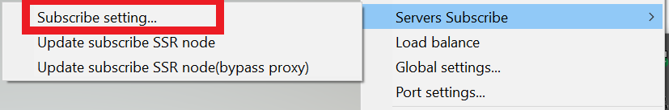

# SSR

Updated: 11 October, 2020


NOTE: This guide will no longer be updated as SSR is no longer under active development and the installation steps won't change anymore.



We personally find that the Netch app is easier to use and fully supports ShadowsocksR. [See the guide here >](../v2ray-shadowsocks/netch-1.md)


This app ONLY support Shadowsocks. It does NOT support v2ray.

## Download and install ShadowsocksR

[Click here](https://wannaflix.net/dl.php?type=d\&id=25) to download the app. It will download it in .ZIP format.


Alternative mirrors:

Download on [Github](https://github.com/shadowsocksrr/shadowsocksr-csharp/releases)&#x20;


Find the ShadowsocksR-win-4.9.2.zip file in your download folder. Unzip it (right click > Extract all... ). Then, open the unzipped folder.

Double-click on the "ShadowsocksR-dotnet4.0" file to run the ShadowsocksR (SSR) app.


If you are running **Windows 7**, please run the ShadowsocksR-dotnet**2.0** instead.



If you get any popups or if your antivirus says anything, select yes / allow access / create exception, according to the situation to allow the app to run.


Close the SSR window if it appeared.

## Add the API link

### Get your API

1. Go to your [client area](https://wannaflix.com/clientarea.php) Shadowsocks page
2. Click on the "Windows SSR" button in the API box to copy the API

### Paste your API

1. Find the ShadowsocksR icon in the tray. **Right-click** on it to show the menu


If you can't find the icon, that means the app is NOT running. Double-click on the "ShadowsocksR-dotnet4.0" file to run the ShadowsocksR (SSR) app.

See previous section.


&#x20;   2\. Go to Server Subscribe > Subscribe setting...

&#x20;   3\. Click Add, and past the API in the URL box. Then click OK.

&#x20;   4\. Right-click on the icon again to show the menu.&#x20;

&#x20;   5\. Go to Server Subscribe > Update subscribe SSR node (bypass proxy) to pull the server list

## Connect

&#x20;   1\. Right-click on the icon

&#x20;   2\. Go to Servers > Wannaflix and select a server from the list

&#x20;   3\. Right-click on the icon again. Click Mode > Global to connect


To disconnect, click Mode > Disable System Proxy&#x20;


## Additional steps

### Disable load balancing

1. Right-click on the icon
2. Click on Load Balance to uncheck it

### Delete the default server

1. **Left-click** on the icon
2. Find the default server. Select it and click "Delete"

## Troubleshooting

So far no common issues have been reported. We'll edit this section should the need arise.
