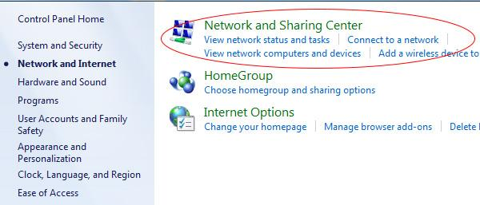

# SmartDNS


Using the VPN will automatically disable your local SmartDNS settings. Please choose either the one or the other.


## WINDOWS 10

### Register your IP address and choose your prefered Netflix region

1. Login to your client area ([https://wannaflix.com/clientarea.php](https://wannaflix.com/clientarea.php))
2. Click on your active SmartDNS subscription
3. Select your prefered Netflix region and click "Update"


You will have to re-submit your IP address each time it changes (router reboots, new location, etc.)


### Change your local DNS settings

#### &#x20;**Open the Network and Sharing Center**

1. Type “control panel” in the search bar and click on _control panel_
2. Go to Network and Internet > Network and Sharing Center&#x20;
3. On the left-hand menu, click "Change adapter settings"

#### Access the dns settings

1. &#x20;Right Click on your network adapter and click on **"Properties"**

2\. Uncheck the Internet Protocol Version 6 (TCP/IPv6) -- **This is important.**

3\. Click on Internet Protocol Version 4 (TCP/IPv4) to highlight and click on **"Properties"**

4\. In the General tab click on Use the following DNS server addresses.&#x20;

* **Preferred DNS server: 165.227.243.239**&#x20;
* **Alternate DNS server: 165.227.254.128**

5\.  Click the **"OK"** button.

## WINDOWS 7

### Register your IP address and choose your prefered Netflix region

1. Login to your client area ([https://wannaflix.com/clientarea.php](https://wannaflix.com/clientarea.php))
2. Click on your active SmartDNS subscription
3. Select your prefered Netflix region and click "Update"


You will have to re-submit your IP address each time it changes (router reboots, new location, etc.)


### Change your local DNS settings

1\. Open the _Control Panel_ by clicking on the _Start button_

2\. Then click on _Network and Internet_&#x20;

3\. Click on _Network and Sharing Center_

4\. Click on _Change adapter settings_

5\. Depending on how your computer is connected to the Internet click either _Local Area Connection_ or_Wireless Network Connection_ if you are connected via Wi-Fi&#x20;

6\. Click on _Properties_

7\. Uncheck the Internet Protocol Version 6 (TCP/IPv6)&#x20;

.jpg>)

8\. Check Internet Protocol Version 4 (TCP/IPv4)

9\. Double click Internet Protocol Version 4 (TCP/IPv4)&#x20;

10\. In the General tab click on Use the following DNS server addresses and enter the DNS servers in the spaces provided: **165.227.243.239** and **165.227.254.128**

11\. Click ok&#x20;

12\. Restart your computer
