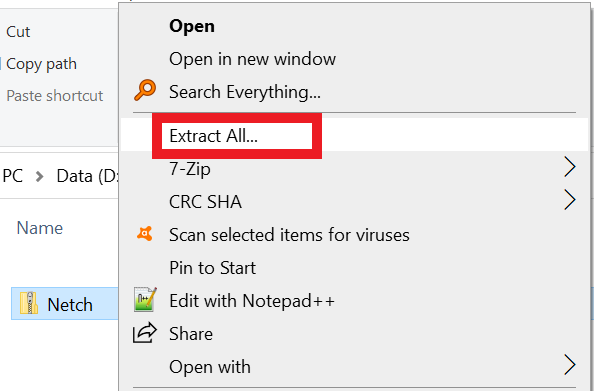
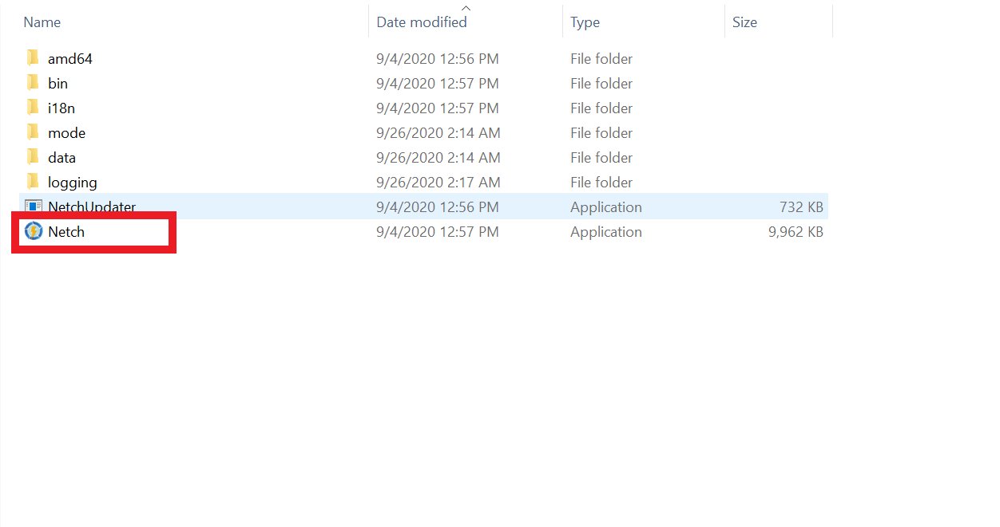
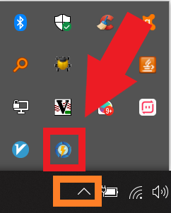
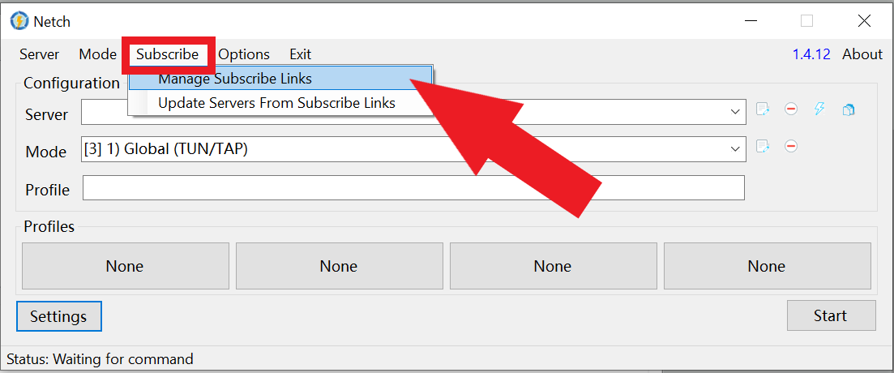
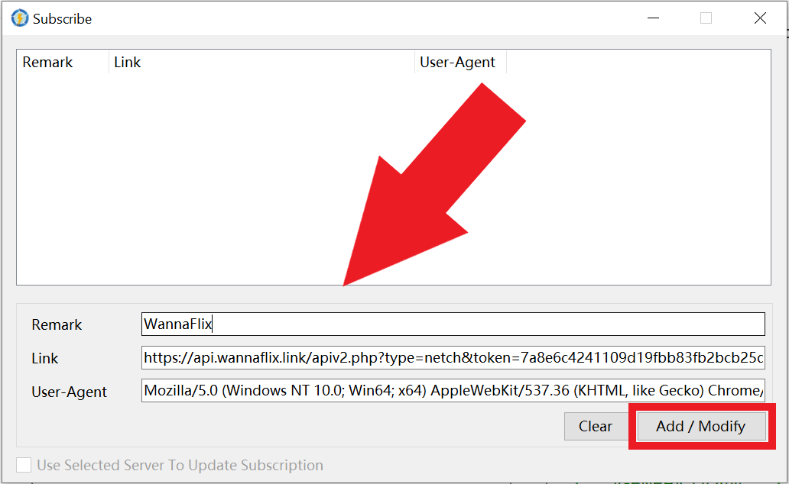
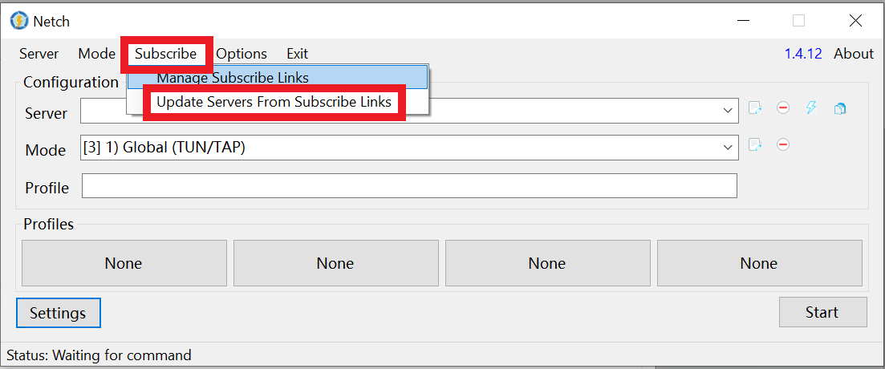
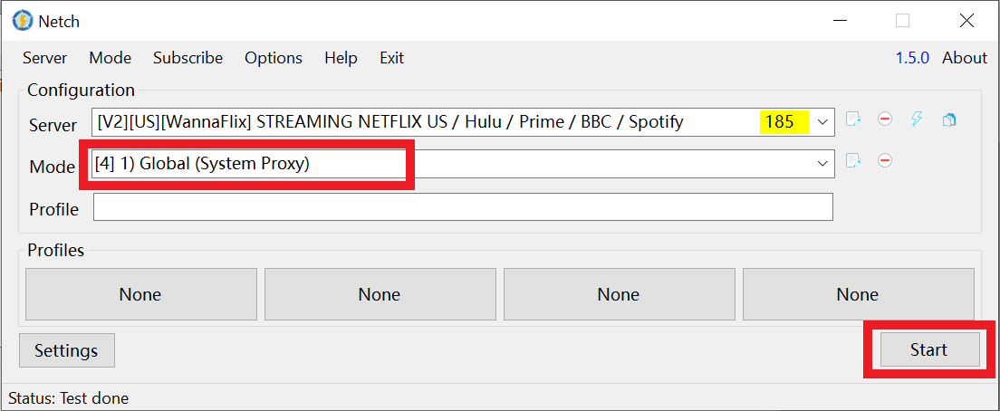

# Netch (Recommended)

Updated: August 13, 2021

Netch supports both v2ray AND ShadowsocksR. It also supports the TUN/TAP engine for capturing packets. This means it can run games without needing additional software.


Netch version 1.8.1+ supports the latest VLESS+XTLS protocol



IMPORTANT: **Netch only supports Windows 10**.&#x20;

If you have Windows XP/7/8/8.1 please do NOT use Netch as you may encounter various issues. Please switch to [v2rayN ](v2rayn-recommended.md)or [SSR ](../shadowsocks/ssr.md)instead.


## Watch Tutorial Video:

We highly recommend watching the video tutorial. You can stream it in China too.

[Video](https://watch.videodelivery.net/ba79ea793a3aa730b2eac46ab94f8c1b)

## Download and install Netch

[Click here](https://get.wannaflix.link/d2178f) to download the app. It will download it in .ZIP format.


Version: v1.8.1

Released on: March 5, 2021.



Alternative mirrors:

Download on [Github](https://github.com/netchx/Netch/releases)&#x20;

NOTE: The Github version is NOT setup to use our DNS, and the "Global" modes are named "Bypass LAN". **We recommend getting our pre-setup version above for ease of use.**

**IMPORTANT: ONLY DOWNLOAD VERSION 1.8.1. Later versions have serious bugs.**


Find the Netch.zip file in your download folder. Unzip it (right click > Extract all... ). Then, open the unzipped folder.&#x20;

Double-click on the "Netch" file to run/start the app.


TIP: **Create a desktop shortcut** by right-clicking Netch, and going to "send to" > "Desktop (create shortcut)"


## Add your servers via the API

### Get your API

1. Go to your [client area](https://wannaflix.com/clientarea.php)&#x20;
2. Under "Windows", select "Netch for Windows"
3. Click on the "Copy API" button to copy the API

### Paste your API

1. If you can't see the Netch window, double click on the Netch icon in the tray

&#x20;    2\. In the Netch app, click Subscribe > Manage Subscribe Links

&#x20;    3\. Paste the API link in the "Link" box. Write "WannaFlix" in the "Remark" box

&#x20;    4\. Click Add/Modify&#x20;

&#x20;    5\. Close the window by clicking the X button on the top right

&#x20;    5\. Go to Subscribe > Update Servers from Subscribe Links to get your server list

## Connect

1. Select a server from the dropdown.
2. For Mode, select "1) Global (System Proxy)"
3. Click Start

## Additional Tips

### Modes

**Global (System Proxy) -** Proxies all apps that use the system proxy settings (like web browsers). Some apps need to be configured to use the system proxy.

**Global (TUN/TAP) -** Proxies all websites and apps through WannaFlix. Good for games, VoIP, and Video Conference, as well as web-browsing, Netflix, Youtube, etc.

**Global (Non System Proxy) -** Starts a SOCKS5 and HTTP server on 2 ports but does not enable the system proxy settings. Only apps that you specifically tell to use the proxy will use WannaFlix's servers.

**Bypass LAN and China (System Proxy) -** Proxies all apps that use the system proxy settings (like web browsers), EXCEPT CHINESE WEBSITES AND APPS. Good for those who want to connect to Wechat, Taobao, and other Chinese websites and apps directly.

**Bypass LAN and China (TUN/TAP) -** Proxies all websites and apps through WannaFlix, EXCEPT CHINESE WEBSITES AND APPS. Good for those who want to connect to Wechat, Taobao, and other Chinese websites and apps directly.

**Bypass LAN and China (Non System Proxy) -** Starts a SOCKS5 and HTTP server on 2 ports but does not enable the system proxy settings. Only apps that you specifically tell to use the proxy AND THAT ARE NOT CHINESE WEBSITES AND APPS will use WannaFlix's servers.

**Other Modes -** You will find that all the other modes are mainly for gaming. These modes only proxy the selected game via WannaFlix's servers and leave the rest unchanged. These modes are only present on the Github version of Netch. We've removed it for ease of use and not to confuse anyone.


We recommend the Global (System Proxy) mode for those who don't have special needs.

If you want to play games or use video-conferencing, please use the Global (TUN/TAP) mode instead.


## Troubleshooting

### Cannot find Privoxy

This means your antivirus has quarantined/blocked part of the app. Open your antivirus software, navigate to the quarantine/virus chest tab, and restore the privoxy.exe program to it's location.&#x20;

You may want to add an exception to the folder as well so the antivirus doesn't block it again in the future.

You can also re-download the app from our website to restore the entire program. This will require adding the API link back in.

### Problem connecting after upgrading Netch app

Open Netch. Click Options > Remove Netch Firewall Rules.

Also try: Modes > Reload Modes.

### Servers don't connect

If you're using the TUN/TAP mode, try disconnecting and reconnecting. If it still fails, try switching to the System Proxy mode instead.

Make sure you are using the correct API link (APIs differ between Netch versions)

If the issue still persists, check your computer time. For v2ray servers, you computer time must be within 90 seconds of the correct time. If it's not, either sync your time with the internet, or adjust it to the correct time in the computer's settings.

### Mode list doesn't show

You are likely running an old version of Windows or lack some dependencies. If you can't see any modes, we recommend switching to [v2rayN ](v2rayn-recommended.md)instead, as troubleshooting which dependencies are lacking will likely be quite complicated.

### Does not work on Windows 7

Netch needs various dependencies that are native on Windows 10, but which are lacking on Windows 7. We recommend switching to [SSR ](../shadowsocks/ssr.md)on Windows 7.

If you still want to try using Netch on Windows 7, you can install the update package from Microsoft:

* [Download KB4503292 MSU for Windows 7 32-bit (x86)](http://download.windowsupdate.com/d/msdownload/update/software/secu/2019/06/windows6.1-kb4503292-x86\_932f3cccb6343fa2339648b391b80d28f8134870.msu)
* [Download KB4503292 MSU for Windows 7 64-bit (x64)](http://download.windowsupdate.com/d/msdownload/update/software/secu/2019/06/windows6.1-kb4503292-x64\_a35bb4ea16d1d529fde9abfe8a0c16e9061f74cd.msu)

### Failed to start Netch/Stuck on connecting

You may need to install lacking dependencies:

* [Visual C++ ](https://support.microsoft.com/en-us/help/2977003/the-latest-supported-visual-c-downloads)
* [.NET Framework 4.8](https://dotnet.microsoft.com/download/dotnet-framework/thank-you/net48-offline-installer)
* [TAP-Windows](https://build.openvpn.net/downloads/releases/tap-windows-9.21.2.exe)
* [Download all dependecies in ZIP format](https://mega.nz/file/9OQ1EazJ#0pjJ3xt57AVLr29vYEEv15GSACtXVQOGlEOPpi\_2Ico)

### NAT test failed when using TUN/TAP mode

First, try another server location.

If it keeps failing, you may need to change your STUN server in your Netch settings.&#x20;

Here are a list of available servers (default port: 3478)

* stun.miwifi.com
* stun.bige0.com
* stun.syncthing.net <- Netch Default
* stun.stunprotocol.org
* iphone-stun.strato-iphone.de
* stun.voipstunt.com
* stun.xten.com
* stun.schlund.de
* numb.viagenie.ca
* stun.ekiga.net
* stun.sipgate.net

4 types of NAT：

`NAT1 → Full Cone NAT` Best for gaming

`NAT2 → Address-Restricted Cone NAT`

`NAT3 → Port-Restricted Cone NAT`

`NAT4 → Symmetric NAT`Worst
