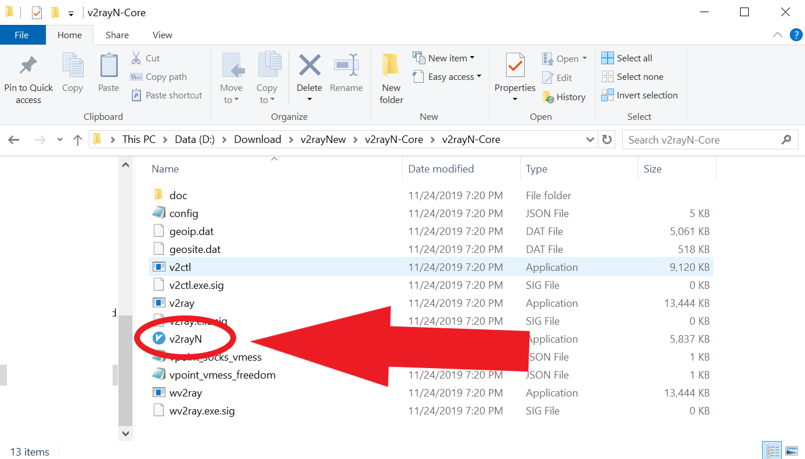
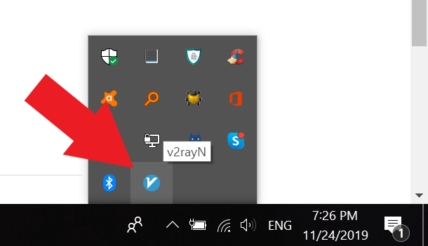
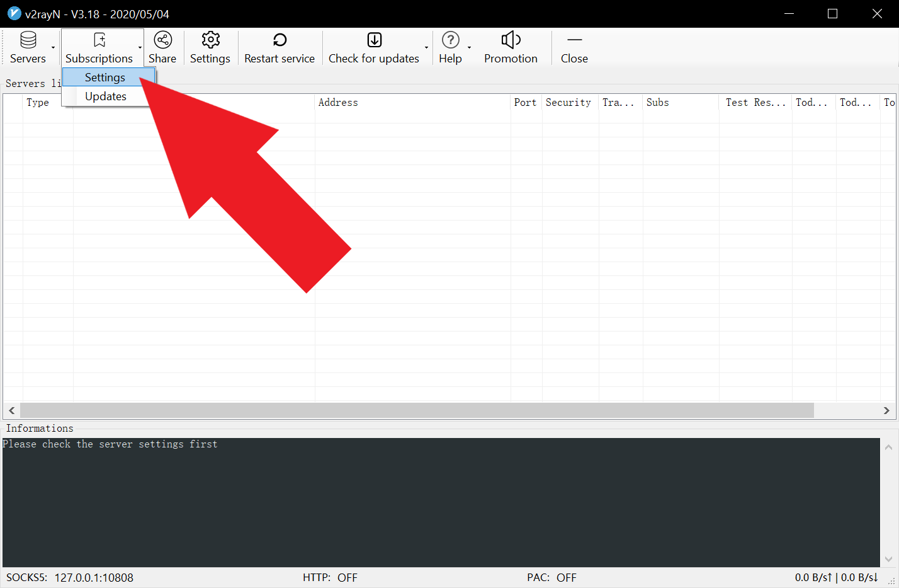
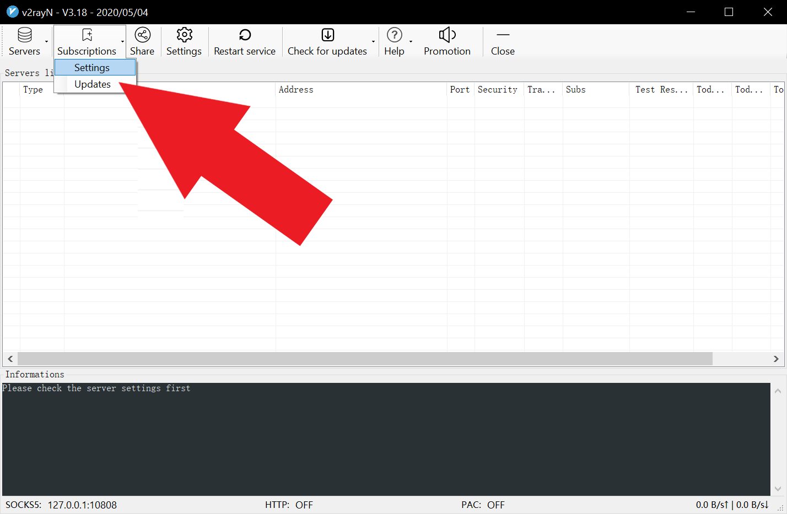
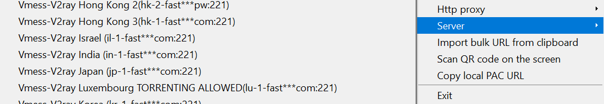
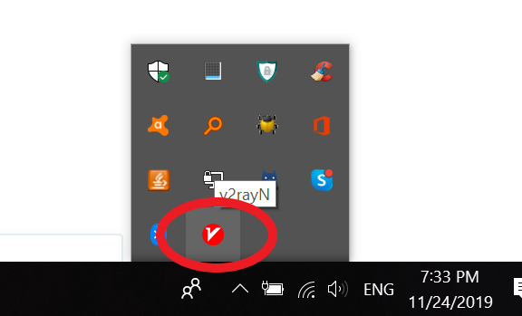

# V2rayN (Recommended)

Updated: August 5, 2022

Recommended environment:  Windows 10+


Required dependencies:

**.NET framework version 4.8** or above.

This version is included in by default in Windows 8/8.1/10, but **needs to be installed separately on Windows 7.**

****[**Click here**](https://support.microsoft.com/en-gb/topic/microsoft-net-framework-4-8-offline-installer-for-windows-9d23f658-3b97-68ab-d013-aa3c3e7495e0) **** to be redirected to Microsoft's website to download the .NET framework installer.


## Watch Tutorial Video:

We highly recommend watching the video tutorial. You can stream it in China too.


NOTE: This is the tutorial for the older version (version 2.50). They look basically the same so it shouldn't be any issues using the old video.

We'll be releasing the new video tutorial soon


[Video](https://watch.cloudflarestream.com/c52143e01e64eed9c6a109e38e3e3239)

## Version 5.26 and up (August 5, 2022)


We HIGHLY recommend upgrading to version 5 or above.


### Download and install

[Click here](https://wannaflix-sz-edge.b-cdn.net/v2rayN-Core-5.36.zip) to download the app. It will download it in .ZIP format.


Alternative mirrors:

Download on [Github](https://github.com/2dust/v2rayN/releases) (it will download as V2rayN-Core.zip instead of V2rayN.zip; look for that filename instead in the next step)



IMPORTANT: When using the github version or **updating to a newer version from within the app** (which uses the github version by default), you will need to manually change the core type to Xray\_core.&#x20;

To do so, open your v2rayN app, and go to Settings > OptionSetting > V2rayN Settings and change the core type from the dropdown menu to Xray\_core.

The version from our website has already been setup to use the Xray\_core by default.


Find the V2rayN-Core.zip file in your download folder. Unzip it (right click > Extract all... ). Then, open the unzipped folder.&#x20;

Double-click on the "V2rayN" file to install.

If there's a pop-up, click "run".


Once installed, you can find the app by searching for "v2rayN" in the search box next to the start menu.&#x20;



You can find V2rayN in the tray at the bottom right corner of your screen.


### Add the servers

#### Get the api link

1. Go to your [client area](https://wannaflix.com/clientarea.php)&#x20;
2. Under "Windows", select "V2rayN for Windows (v4.12+)"
3. Click on the "Copy API" button to copy the API


The API link should start with https://api.wannaflix.com/**apiv3.php**?type=**v2rayn**


#### Paste the api link into the app

1. Open the app by double clicking on the v2rayN icon (blue V) in the tray on the bottom right corner of your screen.

2\. Go to "Subscriptions" > "Settings"

3\. Click "Add" on the bottom

4\. Paste the API link in the url box

5\. Click OK

.png>)

6\. Go to "Subscriptions" > "Updates"

### Select a server

1. Find the v2rayN icon in the tray again
2. This time, RIGHT CLICK on it
3. Go to "Server" and select a server from the list

### Start the VPN

Right click on the V2rayN icon in the tray (bottom right).

Go to "Http Proxy" > "Set system Proxy"

The v2ray icon should turn **red** when connected.

## Version 4.12 and up (March 9, 2021)


The new version uses the faster Xray-core instead of V2ray-core, and supports the XTLS protocol.


### Download and install

[Click here](https://get.wannaflix.link/7c9303) to download the app. It will download it in .ZIP format.


Alternative mirrors:

Download on [Github](https://github.com/2dust/v2rayN/releases) (it will download as V2rayN-Core.zip instead of V2rayN.zip; look for that filename instead in the next step)



IMPORTANT: When using the github version or **updating to a newer version from within the app** (which uses the github version by default), you will need to manually change the core type to Xray\_core.&#x20;

To do so, open your v2rayN app, and go to Settings > OptionSetting > V2rayN Settings and change the core type from the dropdown menu to Xray\_core.

The version from our website has already been setup to use the Xray\_core by default.


Find the V2rayN.zip file in your download folder. Unzip it (right click > Extract all... ). Then, open the unzipped folder.&#x20;

Double-click on the "V2rayN" file to install.

If there's a pop-up, click "run".


Once installed, you can find the app by searching for "v2rayN" in the search box next to the start menu.&#x20;



You can find V2rayN in the tray at the bottom right corner of your screen.


### Add the servers

#### Get the api link

1. Go to your [client area](https://wannaflix.com/clientarea.php)&#x20;
2. Under "Windows", select "V2rayN for Windows (v4.12+)"
3. Click on the "Copy API" button to copy the API


The API link should start with https://api.wannaflix.com/**apiv3.php**?type=**v2rayn**


#### Paste the api link into the app

1. Open the app by double clicking on the v2rayN icon (blue V) in the tray on the bottom right corner of your screen.

2\. Go to "Subscriptions" > "Settings"

3\. Click "Add" on the bottom

4\. Paste the API link in the url box

5\. Click OK

.png>)

6\. Go to "Subscriptions" > "Updates"

### Select a server

1. Find the v2rayN icon in the tray again
2. This time, RIGHT CLICK on it
3. Go to "Server" and select a server from the list

### Start the VPN

Right click on the V2rayN icon in the tray (bottom right).

Go to "Http Proxy" > "Set system Proxy"

The v2ray icon should turn **red** when connected.

## Troubleshooting

### Some apps don't work with V2rayN

Some apps may need additional software to work with V2rayN, such as Signal. In this case, please install [Proxifier](../../installation-guides/windows/proxifier-4.05.md) and they will work.
