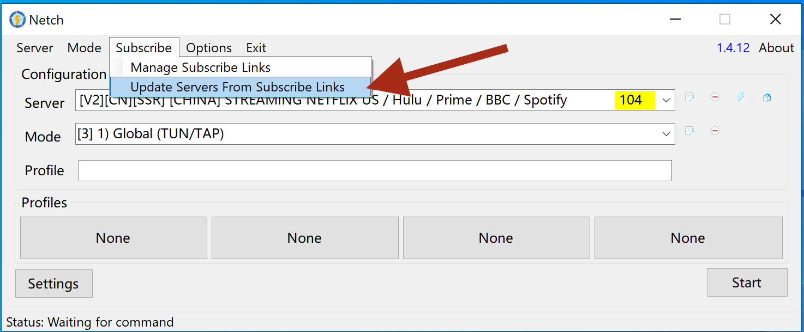

# 更新服务器列表

## **WINDOWS系统**

### **Netch**

点击订阅按钮，然后点击“从订阅链接更新服务器”

### **V2rayNG**

1. 打开V2rayNG软件
2. 前往订阅 &gt; 更新订阅

### **Clash for Windows**

1. 打开Clash
2. 点击“配置文件”选项
3. 点击api链接下的刷新按钮

## **Mac OS 系统**

### **V2rayU** 

1. 点击下拉菜单中的首选项。
2.  选择“订阅”选项。
3. 按下“更新服务器”蓝色按钮。
4. **现在您的服务器已更新。 更新后，点击隐藏日志。**

### **ClashX V1.30.1 and above** 

点击配置 &gt; 托管配置 &gt; 更新

## 安卓

### **ClashR**

点击“配置”按钮，找到“订阅”旁边的三个点，然后按“更新” **。**

### **V2rayNG**

点击屏幕右上角的三个点，然后点击“更新订阅”。

### **BitfrostV**

点击屏幕右上角的+按钮，选择：导入&gt;从URL导入，然后粘贴api链接（可以从客户区获取，和V2rayNG的api链接一样）

## **iOS系统**

### **Shadowrocket**

将服务器订阅点往右拉，然后点击“更新”。

