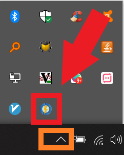
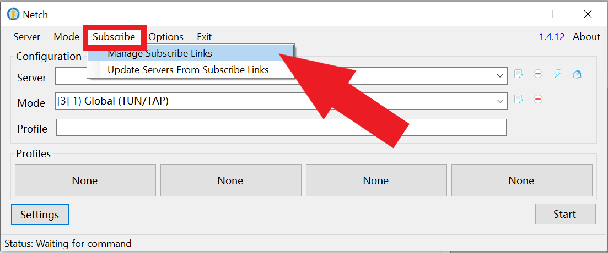
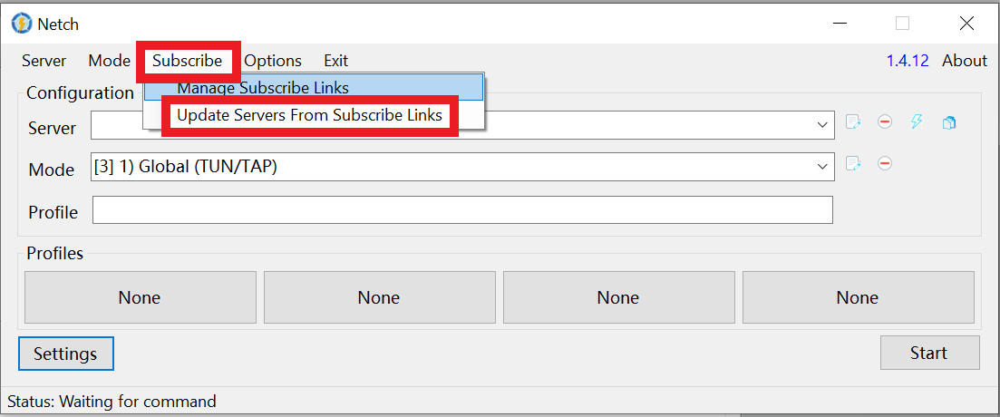

# Netch \(SSR + v2ray\) - 推荐

Netch支持SSR和v2ray，并且能加速游戏。速度和稳定性也很好，因为Netch基于v2ray-core和shadowsocksr-libev。我们强烈推荐运用此软件。 

## Netch 下载并安装

[点这里](https://wannaflix.net/dl.php?type=d&id=24)下载。


Version: v1.5.0

Released on: August 29, 2020.



Github版炒作复杂，也没有运用我们的DNS服务器，推荐使用我们的版本。


找到下载好的Netch.zip， 把它解压。

打开文件，点击Netch来运行软件。

## 通过订阅地址加添服务器

### 拷贝你的订阅地址

1. 登录 [网站](https://wannaflix.com/clientarea.php)
2. 点击Windows netch  按钮来拷贝订阅链接

### 添加订阅地址

1. 点击APP图示打开Netch

     2. 点击Subscribe &gt; Manage Subscribe Links

     3. 吧订阅地址拷贝到 "Link" 那边

     4. 点击 Add/Modify 

     5. 关闭视窗

     5. 点击 Subscribe &gt; Update Servers from Subscribe Links 就能获取服务器信息

## 把语言改成中文

1. 点Settings
2. 把Language换证zh-CN
3. 点Save（保存）

## 链接

1. 窜则服务器
2. 选择 "1\) Global \(System Proxy\)"模式
3. 点 Start （开始）


如果想打游戏，可以选Global \(TUN/TAP\) 模式


